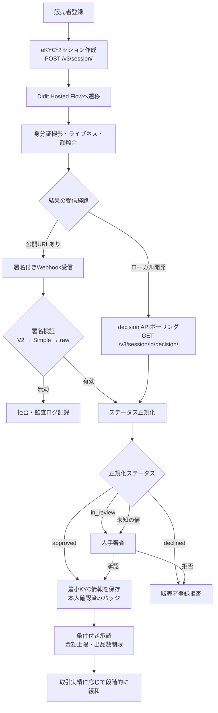
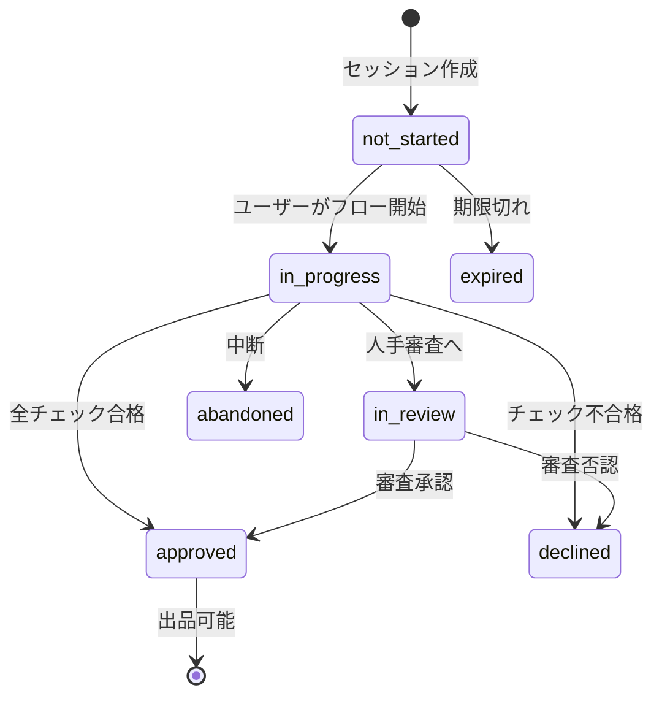
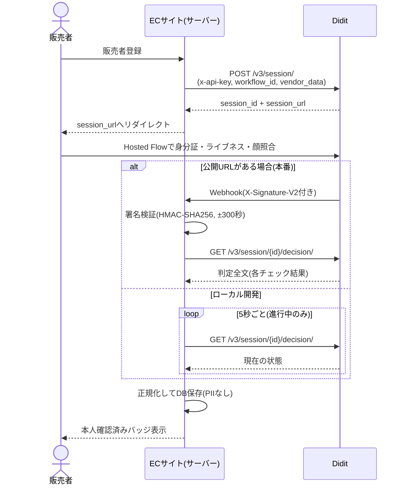
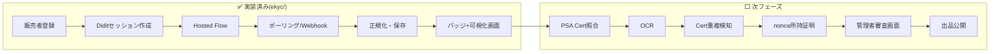

# ポケモンカードC2Cマーケットプレイス — 販売者eKYC設計書

**基準日：2026年8月2日 / 対象地域：日本**

---

## 1. プロジェクト背景

ポケモンカード等の高額トレーディングカード市場では、次の3つが取引の信頼を壊している。

1. **偽物の出品** — 偽スラブ、正規鑑定番号を複製した偽ラベル
2. **カード状態の虚偽表示** — グレード・状態の偽装、盗用画像
3. **盗品・不正アカウントによる取引** — 匿名の使い捨てアカウント、乗っ取り

本プロジェクトは、この課題に対し **eKYCによる販売者本人確認を起点**として、PSA鑑定情報の照合、OCR・画像認識による現物確認を積み上げ、販売者と購入者の双方が安心して取引できるECサイトを構築する。ハッカソンでは**モックを使わず、実際に利用可能な外部APIだけ**で審査・出品・購入フローを実演する。

信頼は一つの判定に集約しない。五層に分けた信頼シグナルのうち、**eKYCは第一層「人物の信頼」を担う**。本書はこの層に焦点を当てる。

| 信頼層 | 確認内容 | 担当技術 |
|---|---|---|
| **人物の信頼** | **本人確認書類、顔照合、ライブネス、重複人物** | **eKYC(本書の対象)** |
| アカウントの信頼 | 電話、メール、端末、IP | eKYC付帯機能+自社実装 |
| 商品情報の信頼 | カード名、グレード、PSA Cert情報 | PSA Public API+OCR |
| 物理商品の信頼 | 所持確認、画像の同一性 | nonce再撮影+OpenCV |
| 取引行動の信頼 | 価格、頻度、通報率 | 自社Risk Engine |

---

## 2. 本プロジェクトにおけるeKYC設計

### 2.1 設計原則

1. **結果の真実のソースはサーバー間通信のみ** — ブラウザのリダイレクト結果では販売許可を出さない。署名検証済みWebhookまたはサーバーからのAPI照会だけを信用する
2. **PIIを自社に保存しない** — 身分証画像・氏名・生年月日はeKYC事業者側に残し、自社DBにはセッションID・正規化ステータス・各チェック結果のみ保存する
3. **未知のステータスは自動承認しない** — 正規化で解釈できないステータスは `in_review`(人手審査)に落とす
4. **eKYC合格 ≠ 無制限出品** — 合格後も新規販売者には金額上限・出品数制限・出金保留を課す(条件付き承認)

### 2.2 販売者登録〜承認フロー

### 2.3 ステータス正規化

Diditのセッションステータスは10種類あり、将来増える可能性もある。内部では7種に正規化し、**販売許可は `approved` のみ**に与える。

| Didit側ステータス | 内部ステータス |
|---|---|
| Not Started | `not_started` |
| In Progress / Awaiting User / Resubmitted | `in_progress` |
| In Review | `in_review` |
| Approved | `approved` |
| Declined | `declined` |
| Abandoned | `abandoned` |
| Expired / Kyc Expired | `expired` |
| **未知の値** | **`in_review`(フェイルセーフ)** |

### 2.4 保存するデータ(最小化)

| 項目 | 内容 |
|---|---|
| `session_id` | eKYC事業者側のセッションID |
| `status` | 正規化ステータス |
| `checks` | 書類・ライブネス・顔照合・IP分析の個別結果(passed/failed/in_review/not_run) |
| `source` | 取得経路(webhook / poll) |
| `updated_at` | 最終更新日時 |
| イベント履歴 | ステータス変化・チェック更新の監査証跡 |

氏名・住所・生年月日・身分証番号・顔画像は保存しない。管理画面にも表示しない。

---

## 3. 利用できるeKYC API

### 3.1 サービス比較(ハッカソン適性)

評価基準:営業面談なしで登録でき、APIキーをセルフサービスで発行でき、**模擬判定ではなく本物の本人確認**を当日中に実行できること。

| サービス | 無料枠 | API発行まで | ハッカソン適性 |
|---|---|---|---:|
| **Didit** | 月500件、カード不要、期限なし | 約60秒〜5分 | **A** |
| Veriff | 15日・50セッション | 当日可 | A− |
| Sumsub | 14日・50件(カード登録必要) | 当日可 | A− |
| iDenfy | 14日または10件 | 当日可の場合あり | B+ |
| Persona | Sandboxは模擬結果のみ | ライブは審査依存 | C |
| TRUSTDOCK | 1か月トライアル | NDA後約5営業日 | C |
| xID | 検証環境あり | 認可クライアント発行に数営業日 | C− |
| LIQUID eKYC | 公開セルフサービスなし | 週単位 | D |
| Polarify | 公開無料APIなし | 平均3か月 | D |

**Diditを採用する理由**: 唯一「当日セルフサインアップ・カード不要・無料枠が本番と同じ処理系」を満たす。無料枠にID書類検証・パッシブライブネス・顔照合・IP分析・重複人物検知が含まれる。国内サービス(TRUSTDOCK等)は本番候補として優秀だが、当日導入には適さない。

### 3.2 Didit APIの構成

実装に必要なAPIは3つだけである。

| API | 用途 |
|---|---|
| `POST /v3/session/` | 検証セッション作成。`workflow_id`・`vendor_data`(自社の販売者ID)・`callback` を送ると、ユーザーを誘導する `session_url` が返る |
| `GET /v3/session/{id}/decision/` | セッションの判定全文を取得。ローカル開発のポーリングにも、Webhook受信後の詳細取得にも使う |
| Webhook(受信) | ステータス確定時にDiditから署名付きでPOSTされる |

### 3.3 Webhook署名検証(3方式)

Diditは1つのWebhookに3種類の署名ヘッダーを付ける。ミドルウェアがJSONを再エンコードしても検証できるよう、**V2 → Simple → raw の順**で試行する。

| ヘッダー | 署名対象 | 特徴 |
|---|---|---|
| `X-Signature-V2` | キーをソートして再エンコードしたJSON | 再エンコード耐性あり。**第一候補** |
| `X-Signature-Simple` | `{timestamp}:{session_id}:{status}:{webhook_type}` | エンコード非依存。ただし判定詳細の完全性は保証しない |
| `X-Signature` | 生のリクエストボディ | 生バイトに直接アクセスできる場合のみ |

共通ルール: HMAC-SHA256、タイムスタンプ許容±300秒(リプレイ防止)、タイミングセーフ比較。

### 3.4 本番移行時のeKYC

日本の犯罪収益移転防止法対応が必要になる本番では、**ICチップ読取・JPKI(マイナンバーカード公的個人認証)を主経路**とする国内サービス(TRUSTDOCK、LIQUID eKYC、xID等)への切替または併用を設計する。2027年4月以降の非対面本人確認制度変更を見据え、画像撮影+セルフィー方式だけに固定しない。Diditの位置づけは「ハッカソン〜PoCの実証エンジン」である。

---

## 4. ハッカソンで実装できる範囲

### 4.1 実装済み(検証完了)

第一段階として、eKYCフローの縦一本を `ekyc/` に実装し、**Didit本番APIとの疎通まで検証済み**である。

- 販売者登録 → Diditセッション作成(実API) → Hosted Flow遷移
- decision APIポーリングによる状態取得(ローカル開発はWebhook不要で完結)
- Webhook受信エンドポイント(3方式の署名検証、無効署名は401拒否、監査ログ記録)
- ステータス正規化(未知の値は `in_review` へフェイルセーフ)
- SQLiteへの最小データ保存(PIIなし)+ 状態変化のイベント履歴
- **認証フロー可視化**: 段階ステッパー(登録→セッション→書類→ライブネス→顔照合→判定)と状態変化タイムラインを同一画面にリアルタイム表示
- ユニットテスト65件(署名検証・正規化・フロー導出・DB)、libカバレッジ98%

### 4.2 ハッカソン全体で実装する範囲

| 優先 | 実装内容 | 状態 |
|---:|---|---|
| 1 | 販売者登録・eKYC(Didit)・署名付きWebhook | ✅ 完了 |
| 2 | 販売者ステータス・可視化 | ✅ 完了 |
| 3 | カード撮影・OCR(Tesseract.js / Google Vision) | ⬜ |
| 4 | PSA Public API照会・正規化 | ⬜ |
| 5 | Cert番号重複検知(DBユニーク制約) | ⬜ |
| 6 | nonce付き所持確認 | ⬜ |
| 7 | ルールベースRisk Engine・管理者審査画面 | ⬜ |
| 8 | 商品ページ(信頼シグナルの個別表示) | ⬜ |
| 9 | Stripe Test Modeでの購入・売上保留 | ⬜ |

### 4.3 実装しないもの

- 独自の法定eKYCエンジン(事業者のHosted Flowを使う)
- 画像だけによる完全な真贋判定・PSA相当の自動グレーディング
- 架空・加工・他人の身分証を使ったテスト(**同意したチームメンバー本人の正規書類のみ使用**)
- 固定JSONによるPSA成功結果などのモック
- 「AI鑑定済み」「真贋100%保証」「PSA公式パートナー」等の誤認表示

### 4.4 eKYCデモシナリオ

1. 販売者が新規登録し、Diditの**本物の**Hosted Flowで本人確認する
2. 可視化画面のステッパーが「書類✓ → ライブネス✓ → 顔照合✓」とリアルタイムに進む
3. サーバー間通信(ポーリング/Webhook)経由で「本人確認済み」バッジに変わる — ブラウザ側の結果は信用していないことを説明する
4. タイムラインで「いつ・何が・どの経路で」変化したかの監査証跡を見せる
5. 画面に氏名・住所等のPIIが一切表示されない(保存もしていない)ことを見せる

### 4.5 注意事項

- eKYC事業者のWebhookシークレット・APIキーはサーバー側環境変数のみに置き、ブラウザへ送らない
- ライブデモでは同意済みメンバーの本人確認を事前リハーサルし、当日はスクリーンにPIIを映さない構成にする
- 古物営業法(古物競りあっせん業)・特商法・個人情報保護法の対応は、閉じたデモと実営業を区別して本番前に整理する

---

## 5. 結論

eKYCは多層防御の第一層であり、単独では「販売者が将来不正を行わないこと」を保証しない。しかし、**実在する本人と販売アカウントを結び付け、不正の初期コストを大きく引き上げる起点**になる。

ハッカソンでは、Diditの本番APIによるライブeKYCを軸に、「サーバー間通信のみを信用する」「PIIを持たない」「不明な状態は承認しない」という設計をそのまま動くコードで示す。この土台の上に、PSA照合・OCR・所持証明・重複検知を独立した信頼シグナルとして積み上げていく。
