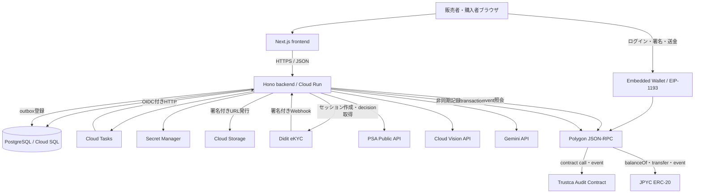
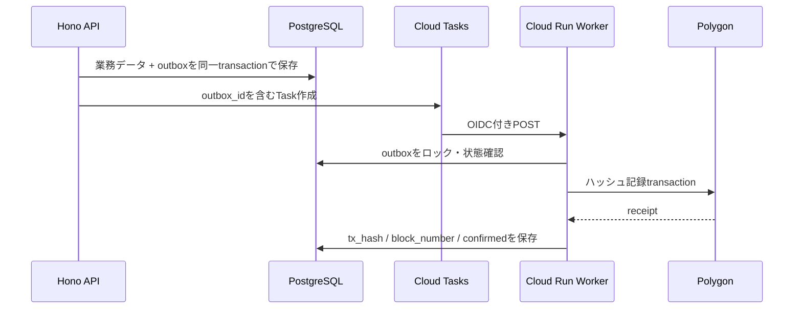
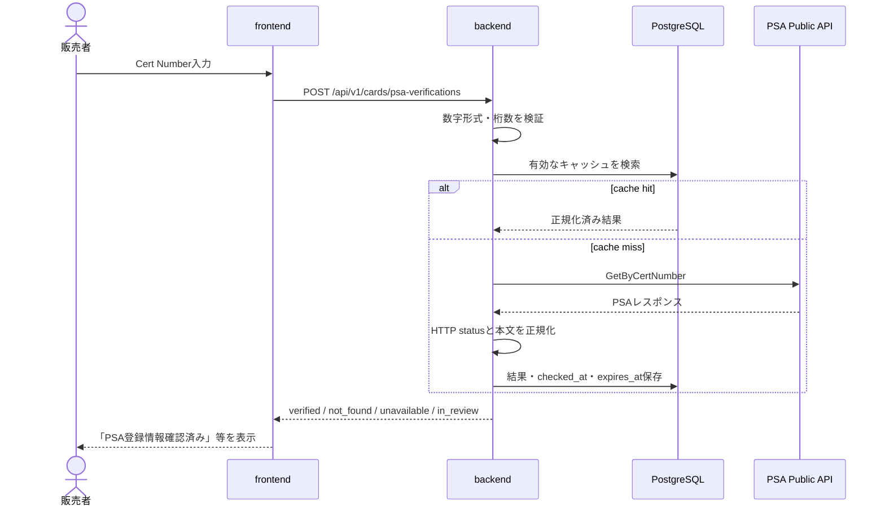
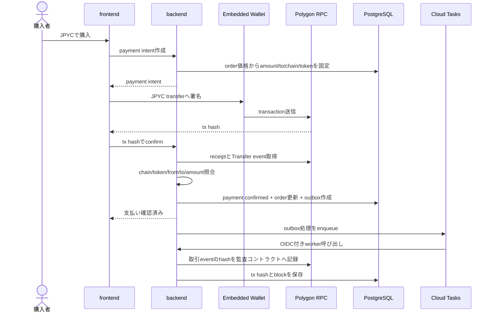

# API一覧・連携方針

**基準日: 2026年8月12日**

本書は、Trustcaが利用する外部API、ブロックチェーン/RPC、GCPマネージドサービス、およびTrustcaバックエンドが提供する内部APIの一覧と利用方針を定義する。実装時に各担当者が認証方式、データの流れ、失敗時の扱いを同じ前提で参照できることを目的とする。

対象読者: バックエンド、フロントエンド、インフラ、スマートコントラクトの実装担当者。

本書はAPIの全レスポンス項目を複製するものではない。外部仕様は変更され得るため、実装時には本書の「公式資料」から最新仕様を再確認する。

---

## 1. スコープとステータス

### 1.1 対象

- 外部サービス: PSA、Didit、Cloud Vision、Gemini、Cloud Storage
- Web3/決済: MetaMask Embedded Wallets（旧Web3Auth）、Polygon RPC、JPYC
- GCP基盤: Cloud Tasks、Pub/Sub、Secret Manager、Cloud SQL
- Trustca内部API: 販売者審査、カード検証、出品、注文、決済、非同期オンチェーン記録
- DBアクセス: HTTP APIとして公開せず、`backend/src/db/`のリポジトリ関数として管理するサービス境界

### 1.2 ステータス表記

| 表記 | 意味 |
|---|---|
| PoC実装済み | `poc/ekyc/`で外部サービスとの実疎通を確認済み。目標構成への移植は別途必要 |
| 基盤のみ | 接続先となるfrontend/backend/DBの骨格のみ存在 |
| 調査済み | 公式資料と利用方針を確認済み。コードは未実装 |
| 未実装 | 設計上必要だが、詳細調査またはコード実装が未完了 |
| 将来候補 | MVPでは使わず、要件拡大時に採用を再判断する |

---

## 2. 共通設計原則

### 2.1 呼び出し境界

1. 外部APIの秘密情報を使う呼び出しは、すべてCloud Run上の`backend/`から行う。ブラウザからPSA、Didit Management API、Gemini、Cloud Visionを直接呼ばない。
2. frontendはTrustcaバックエンドだけを呼び、業務判定を持たない。ただし、ユーザー本人によるウォレット接続・署名・送金はブラウザ内のウォレットプロバイダから実行する。
3. ウォレットアドレスやトランザクションハッシュをブラウザが送っただけでは信用しない。署名検証またはバックエンドからのRPC照会で確認する。
4. DBを直接操作するHTTPエンドポイントは作らない。route → service → repositoryの順で呼び出し、`backend/src/db.ts`の`pg.Pool`を唯一の接続プールとする。

### 2.2 信頼とフェイルセーフ

- 外部APIの未知ステータス、未知フィールド、タイムアウト、形式不正は自動承認に変換しない。`in_review`、`pending`、`unavailable`等の非承認状態に倒す。
- PSA番号照会は「PSAデータベースに登録された番号との一致」であり、撮影された現物の真正性を保証しない。UIでは「PSA登録情報確認済み」と表示し、「真正品保証」「PSA公式認定」等の表現を使わない。
- Vision/Geminiの出力は補助的な信頼シグナルであり、単独で真贋を確定しない。スコア閾値未満、モデルエラー、判断不能は運営者確認へ回す。
- eKYCはDiditの署名検証済みWebhook、またはバックエンドからのdecision取得結果だけを判定根拠にする。

### 2.3 タイムアウト・再試行・冪等性

| 種別 | タイムアウトの初期値 | 自動再試行 | 補足 |
|---|---:|---:|---|
| 読み取り専用外部API（PSA等） | 5秒 | 最大1回 | ネットワークエラー、`429`、`5xx`のみ。指数バックオフ+ジッター |
| AI/画像解析 | 20秒 | 最大1回 | 同じ画像ハッシュ・同じモデル・同じプロンプトなら重複実行を抑止 |
| eKYCセッション作成 | 10秒 | 条件付き1回 | `workflow_id + vendor_data`を冪等キーとして扱う |
| Webhook | 5秒以内に応答 | 送信元が再送 | 受信イベントIDまたはペイロードハッシュで重複排除 |
| RPC読み取り | 10秒 | 最大2回 | 複数RPCへの切替はMVP後に検討 |
| RPC書き込み | 30秒 | 同一nonceで無条件再送しない | outboxの冪等キーとオンチェーン記録IDで重複防止 |
| Cloud Tasks Worker | 30秒 | Cloud Tasksで設定 | Worker側も必ず冪等にする |

`4xx`は原則再試行しない。ただし`408`と`429`は一時エラーとして扱う。外部APIが独自のエラー仕様を持つ場合は各節のルールを優先する。

### 2.4 認証情報とログ

- 本番のAPIキー、Webhook secret、RPCキー、オペレータ秘密鍵はSecret Managerで管理する。
- `.env.example`には変数名と説明だけを書き、値をコミットしない。
- `NEXT_PUBLIC_*`へ置けるのは公開前提のClient ID、chain ID、公開コントラクトアドレスだけである。秘密鍵、Bearer Token、Webhook secretを置かない。
- Authorizationヘッダー、署名、セッショントークン、身分証情報、画像のbase64本文をログに出さない。
- 外部レスポンスの保存は必要な正規化項目を原則とし、raw payloadを保存する場合は目的、保持期限、閲覧権限を定義する。

---

## 3. システム全体のAPI関係



---

## 4. 外部API・サービス一覧

| ID | サービス | 主用途 | 呼び出し元 | 認証 | ステータス | 関連Issue |
|---|---|---|---|---|---|---|
| EXT-PSA-01 | PSA Public API | Cert Numberの登録情報照会 | backend | Bearer Token | 調査済み | #15, #20 |
| EXT-DIDIT-01 | Didit Sessions API | eKYCセッション作成・結果取得 | backend | `x-api-key` | PoC実装済み | #13, #20 |
| EXT-DIDIT-02 | Didit Webhook | eKYC状態変更の受信 | Didit → backend | HMAC-SHA256 | PoC実装済み | #13, #20 |
| EXT-VISION-01 | Cloud Vision API | OCR、ラベル、オブジェクト位置検出 | backend | Google ADC/IAM | 調査済み | #16, #20 |
| EXT-GEMINI-01 | Gemini API | カード画像の構造化補助判定 | backend | API KeyまたはGoogle認証 | 調査済み | #16, #20 |
| EXT-GCS-01 | Cloud Storage | カード画像保管・署名付きアップロード | backend / browser | IAM + V4署名URL | 調査済み | #16, #20 |
| EXT-WALLET-01 | MetaMask Embedded Wallets（旧Web3Auth） | ソーシャルログイン、EVMウォレット生成・署名 | frontend | Client ID + 許可Origin | 調査済み | #18, #20 |
| EXT-RPC-01 | Polygon JSON-RPC | chain ID、残高、receipt、event、送信 | frontend / backend | RPC事業者ごと | 調査済み | #17, #18, #20 |
| EXT-JPYC-01 | JPYC ERC-20 | 残高確認・送金・支払い確認 | wallet / backend | ウォレット署名 | 調査済み | #18, #20 |
| GCP-TASKS-01 | Cloud Tasks | DB確定後の非同期オンチェーン処理 | backend | IAM / OIDC | 採用予定 | #17, #20 |
| GCP-PUBSUB-01 | Pub/Sub | 複数購読者へのイベント配信 | backend / worker | IAM | 将来候補 | #17, #20 |
| GCP-SM-01 | Secret Manager | APIキー・署名鍵の取得 | backend | IAM | 採用予定 | #8, #20 |
| GCP-SQL-01 | Cloud SQL Connector | Cloud RunからPostgreSQLへ接続 | backend | IAM + DB認証 | 基盤のみ | #14, #20 |

---

## 5. 外部APIの利用方法

### 5.1 PSA Public API

#### 目的

販売者が入力したPSA Cert NumberをPSAの登録情報と照合し、カード名、年、ブランド、対象、グレード等の出品入力と比較する。

#### 公式エンドポイント

```http
GET https://api.psacard.com/publicapi/cert/GetByCertNumber/{certNumber}
Authorization: bearer {PSA_ACCESS_TOKEN}
```

PSAの公開資料で案内されているAPIは、Cert Numberによる単件検索である。アクセストークンはPSAアカウントへログインして発行する。

```bash
curl --request GET \
  --url "https://api.psacard.com/publicapi/cert/GetByCertNumber/${PSA_CERT_NUMBER}" \
  --header "Authorization: bearer ${PSA_ACCESS_TOKEN}"
```

#### Trustcaでの正規化

| PSA側の結果 | Trustca内部状態 | 挙動 |
|---|---|---|
| `IsValidRequest=true`かつ`ServerMessage=Request successful` | `verified` | 正規化した登録情報を保存し、出品入力と比較 |
| `IsValidRequest=true`かつ`ServerMessage=No data found` | `not_found` | 自動承認せず、番号再確認または運営者確認 |
| `IsValidRequest=false` | `invalid_request` | `400`相当として入力エラーを返す |
| タイムアウト、`429`、`5xx` | `unavailable` | 出品を「確認待ち」にし、成功扱いにしない |
| 未知のレスポンス | `in_review` | 秘密情報を除いたresponse shapeとrequest IDを警告ログへ記録し、自動承認しない |

PSAは`200`でも「該当なし」「入力不正」をレスポンス本文で返すため、HTTP statusだけで成功判定しない。`500`は認証情報不正の場合にも返り得るため、連続再試行せず設定エラーとして監視する。

#### キャッシュ・制限

- 同じCert Numberへの照会はDBキャッシュを利用する。MVPの初期TTLは24時間とし、環境変数で変更可能にする。
- PSAの公開ドキュメントには固定の呼び出し上限が掲載されていない。利用アカウントの契約画面またはPSA窓口で確認し、推測値を仕様にしない。
- APIレスポンスの再配布・画面表示範囲はPSA API End User Agreementを実装前に確認する。

#### 表示上の制限

PSA自身が「Cert Numberの確認だけでは、Web上に掲載された現物が真正なPSA鑑定品であることを保証しない」と明記している。したがって、PSA照会結果は画像所持確認、Cert重複検知、出品者eKYCと組み合わせる。

公式資料: [PSA Public API Documentation](https://www.psacard.com/publicapi/documentation)、[PSA Cert Verification](https://www.psacard.com/cert)

### 5.2 Didit Sessions API / Webhook

#### 利用API

| API | 用途 | 認証 |
|---|---|---|
| `POST https://verification.didit.me/v3/session/` | Hosted Flow用セッション作成 | `x-api-key` |
| `GET https://verification.didit.me/v3/session/{id}/decision/` | セッション結果取得・ポーリング | `x-api-key` |
| Didit → `POST /api/v1/webhooks/didit` | 状態変更通知 | HMAC-SHA256 |

```bash
curl --request POST \
  --url "https://verification.didit.me/v3/session/" \
  --header "x-api-key: ${DIDIT_API_KEY}" \
  --header "Content-Type: application/json" \
  --data "{\"workflow_id\":\"${DIDIT_WORKFLOW_ID}\",\"vendor_data\":\"${SELLER_ID}\",\"callback\":\"${CALLBACK_URL}\"}"
```

- backendで`workflow_id + vendor_data`が同一の未完了セッションを先に検索し、存在する場合はそのURLを返す。Didit側の暗黙の冪等性には依存しない。
- V3のレスポンスは`url`、`session_id`、`session_token`を含む。`session_token`は秘密情報として扱う。
- Webhookは`X-Timestamp`が現在時刻から±300秒以内であることを確認し、`X-Signature-V2`、raw bodyの`X-Signature`、`X-Signature-Simple`の順で検証する。
- `X-Signature-Simple`はenvelopeだけを認証し、`decision`本文は認証しない。この方式だけで検証できた場合は、decision APIから結果を再取得する。
- V3 decisionは`id_verifications[]`、`liveness_checks[]`、`face_matches[]`等の配列形式であり、旧V2の単数フィールドを前提にしない。
- WebhookはイベントIDで重複排除し、署名検証後にだけDBを更新する。

現行の`poc/ekyc/`は署名をV2 → Simple → rawの順で確認し、Simple成功時にも埋め込みdecisionを参照し得る。`backend/`への移植時は、上記の現行仕様に合わせて検証順序と信頼境界を修正する。

公式資料: [Didit API Reference](https://docs.didit.me/api-reference/overview)、[Create Session](https://docs.didit.me/sessions-api/create-session)、[Webhooks](https://docs.didit.me/integration/webhooks)

### 5.3 Cloud Vision API

#### 目的と利用機能

静止画のカード撮影にはCloud Vision APIの`images:annotate`を使用する。Vertex AI Vision（動画ストリーム・コーパス管理向け）と混同しない。

| Feature | Trustcaでの用途 |
|---|---|
| `TEXT_DETECTION` | PSAラベル、カード名、番号等のOCR候補抽出 |
| `OBJECT_LOCALIZATION` | カード、スラブ、ラベル等の領域候補検出 |
| `LABEL_DETECTION` | 画像内容がカード撮影として妥当かの補助判定 |

```http
POST https://vision.googleapis.com/v1/images:annotate
Authorization: Bearer {Google access token}
Content-Type: application/json
```

```json
{
  "requests": [
    {
      "image": { "source": { "gcsImageUri": "gs://BUCKET/OBJECT" } },
      "features": [
        { "type": "TEXT_DETECTION", "maxResults": 20 },
        { "type": "OBJECT_LOCALIZATION", "maxResults": 20 }
      ]
    }
  ]
}
```

Cloud VisionはOCR、ラベル、オブジェクト位置を返すが、2枚のカード角部画像が同一の物理個体かを直接保証するAPIではない。画像ハッシュ、撮影nonce、OpenCV等の特徴比較、Geminiによる補助説明、運営者確認を別レイヤーとして組み合わせる。

公式資料: [Cloud Vision REST API](https://cloud.google.com/vision/docs/reference/rest)、[OCR](https://cloud.google.com/vision/docs/ocr)

### 5.4 Gemini API

#### 目的

- OCR結果と画像を合わせたカード属性候補の抽出
- 出品時画像と到着後画像の相違点を、構造化JSONで説明
- 人手審査に渡す確認ポイントの生成

MVPではGemini Developer APIの画像入力を候補とする。モデル名、API version、media resolutionは環境変数で固定し、モデル更新による結果変化を監査ログへ残す。2026年8月時点ではInteractions APIのcore機能が`v1`でGAとなっているため、preview機能が必要でない限り`v1`を使用する。

```http
POST https://generativelanguage.googleapis.com/v1/interactions
x-goog-api-key: {GEMINI_API_KEY}
Content-Type: application/json
```

画像は公開URLにせず、必要に応じてinline dataまたは短時間だけ有効な参照方法を使う。レスポンスはJSON Schemaで構造化し、さらにアプリ側のschema validatorで検証する。構造化出力はJSON形式を保証しても、値の意味的正しさまでは保証しないため、判定結果をそのまま`verified`へ変換しない。

公式資料: [Gemini API Image Understanding](https://ai.google.dev/gemini-api/docs/image-understanding)、[Structured Outputs](https://ai.google.dev/gemini-api/docs/structured-output)、[API Versions](https://ai.google.dev/gemini-api/docs/api-versions)

### 5.5 Cloud Storage

カード画像はDBへbase64で保存せず、非公開Cloud Storage bucketへ保存する。DBにはobject key、content type、byte size、SHA-256、撮影種別、作成者、保持期限を保存する。

アップロード手順:

1. frontendが`POST /api/v1/uploads/card-images`へcontent typeと用途を送る。
2. backendがobject keyを採番し、短時間有効なV4署名付きPUT URLを返す。
3. browserがCloud Storageへ直接アップロードする。
4. frontendが完了通知をbackendへ送り、backendがobject metadataとsizeを検証する。
5. backendまたは非同期workerがobjectを読み取り、SHA-256を算出してDBへ保存する。ブラウザ申告値だけを採用しない。

署名URLは特定object、HTTP method、content type、有効期限に限定する。bucketを公開しない。

公式資料: [Cloud Storage V4 Signed URLs](https://cloud.google.com/storage/docs/access-control/signing-urls-with-helpers)

### 5.6 MetaMask Embedded Wallets（旧Web3Auth）

Node-Stayは`@web3auth/modal` v10系を使用している。Web3AuthはMetaMask/Consensys傘下へ移行しているため、Trustcaへの導入時は現行のMetaMask Embedded Walletsドキュメントとサポート中SDKを再確認し、旧バージョンを固定コピーしない。

利用方針:

- Google、メール等のソーシャルログインからEVMウォレットを取得する。
- frontendはEIP-1193 providerをviemへ渡し、署名とJPYC送金を実行する。
- Client IDは公開値だが、管理画面で本番/開発Originを制限する。
- Web3Authログイン完了だけではTrustcaの認証完了にしない。backendが発行したnonceへ署名し、署名検証後にwallet addressをユーザーへ紐付ける。
- 秘密鍵をfrontendコード、localStorage、backendへ取り出して保存しない。
- Account Abstraction / PaymasterはMVPの必須条件にせず、通常送金の動作確認後に導入を判断する。

公式資料: [MetaMask Embedded Wallets](https://docs.metamask.io/embedded-wallets/)、[Web3Auth](https://web3auth.io/)

### 5.7 Polygon JSON-RPC

MVPの検証ネットワークはPolygon Amoy（chain ID `80002`、gas token `POL`）を初期候補とする。本番のPolygon PoSはchain ID `137`であり、環境を明確に分離する。

| JSON-RPC method | 用途 | 主な呼び出し元 |
|---|---|---|
| `eth_chainId` | 接続ネットワーク確認 | frontend / backend |
| `eth_call` | JPYC `balanceOf`、`decimals`等の読み取り | frontend / backend |
| `eth_getTransactionReceipt` | 支払い成功、block、logの確認 | backend |
| `eth_getTransactionByHash` | 送信先・送信者・inputの補助確認 | backend |
| `eth_getLogs` | JPYC `Transfer`、監査コントラクトevent取得 | backend worker |
| `eth_sendRawTransaction` | 署名済みtransaction送信 | wallet / worker |

無料共有RPCはデモ時の単一障害点になり得る。RPC URLは環境変数化し、API key付きURLをfrontendへ露出しない。

公式資料: [Polygon PoS RPC Endpoints](https://docs.polygon.technology/pos/reference/rpc-endpoints)

### 5.8 JPYC ERC-20

2025年10月に発行開始された資金移動型JPYCの公式コントラクトアドレスは、Ethereum、Avalanche C-Chain、Polygon mainnetで次の値と案内されている。

```text
0xE7C3D8C9a439feDe00D2600032D5dB0Be71C3c29
```

**これはmainnet用の情報であり、Amoy用アドレスとして流用しない。** MVPでは`CHAIN_ID`と`JPYC_TOKEN_ADDRESS`をセットで管理し、Amoy上の検証用トークンまたはJPYC側が案内するテスト環境を別設定にする。mainnet送金は明示的なリリース判断まで無効にする。

利用するERC-20 interface:

- `decimals()` — 金額換算。`18`をコードへ無条件に埋め込まない
- `balanceOf(address)` — 支払い前の残高表示
- `transfer(address,uint256)` — MVPの購入者から販売者への直接送金
- `Transfer(address,address,uint256)` — backendのreceipt検証

backendはreceiptの`status`、chain ID、token contract、`from`、`to`、`value`をpayment intentと照合する。tx hashはDBで一意にし、別注文への再利用を拒否する。

公式資料: [JPYC正式リリース](https://corporate.jpyc.co.jp/news/posts/jpyc-ex-launch)、[公式コントラクトアドレスに関する注意](https://corporate.jpyc.co.jp/news/posts/Notice)

### 5.9 Cloud Tasks / Pub/Sub

単一のオンチェーン記録ジョブを、指定時刻・指定回数でCloud Run workerへ配送する用途にはCloud Tasksを採用する。



- Cloud TasksからCloud Runへの認証はOIDC ID tokenを使う。
- Task名はoutbox IDから安定して生成し、重複enqueueを抑止する。
- Cloud Tasksの配送保証だけに依存せず、Workerは処理済みoutboxを再実行しない。
- DB commit後にTask作成へ失敗する可能性に備え、未配送outboxを再enqueueするreconcilerを用意する。
- Pub/Subは複数の独立購読者が必要になった時点で採用を再検討する。標準はat-least-onceであるため、採用時もアプリ側の冪等性は必要である。

公式資料: [Cloud Tasks HTTP Target](https://cloud.google.com/tasks/docs/creating-http-target-tasks)、[Pub/Sub Subscription Overview](https://cloud.google.com/pubsub/docs/subscription-overview)

### 5.10 Secret Manager / Cloud SQL Connector

Secret Managerは実行時にsecret versionを取得するか、Cloud Runの環境変数/volumeへsecretを割り当てて利用する。サービスアカウントには必要なsecret単位で`Secret Manager Secret Accessor`を付与する。

Cloud RunからCloud SQL for PostgreSQLへはCloud SQL Node.js ConnectorまたはCloud RunのCloud SQL接続を利用する。ローカルではDocker ComposeのPostgreSQLへ`DATABASE_URL`で接続し、`backend/src/db.ts`の公開interfaceは環境間で変えない。

公式資料: [Secret Manager: Access a secret version](https://cloud.google.com/secret-manager/docs/access-secret-version)、[Cloud SQL Node.js Connector](https://cloud.google.com/sql/docs/postgres/connect-connectors)

---

## 6. Trustca内部HTTP API

### 6.1 共通規約

- Base path: `/api/v1`
- Content-Type: `application/json; charset=utf-8`
- 日時: UTCのRFC 3339文字列
- ID: URLで意味を推測できないUUID
- 金額: 小数を使わず、法定通貨は`amountMinor`、ERC-20は`amountAtomic`を10進文字列で返す
- EVM address: 入力時に検証し、DB検索用の正規化値と表示用checksum addressを分ける
- 作成系API: `Idempotency-Key`を受け付け、同一key・同一requestには同じ結果を返す
- 一覧系API: `limit`とopaque cursorによるpaginationを使う

成功レスポンス:

```json
{
  "success": true,
  "data": {},
  "requestId": "req_..."
}
```

失敗レスポンス:

```json
{
  "success": false,
  "error": {
    "code": "PSA_UNAVAILABLE",
    "message": "PSA登録情報を現在確認できません。時間をおいて再試行してください。"
  },
  "requestId": "req_..."
}
```

`error.code`は機械判定用の固定英字、`message`はユーザー向けの自然な日本語とする。外部APIの生エラーメッセージをそのままブラウザへ返さない。

### 6.2 現在存在するAPI

| Method | Path | 用途 | 状態 |
|---|---|---|---|
| `GET` | `/healthz` | backendとDBの疎通確認 | backend実装済み |
| `POST` | `/api/v1/sellers` | 販売者プロフィール作成 | backend実装済み(#13) |
| `GET` | `/api/v1/sellers/{sellerId}` | 販売者公開情報取得 | backend実装済み(#13) |
| `POST` | `/api/v1/sellers/{sellerId}/kyc-sessions` | Diditセッション作成 | backend実装済み(#13) |
| `GET` | `/api/v1/sellers/{sellerId}/verification` | 正規化eKYC状態取得・任意poll | backend実装済み(#13) |
| `POST` | `/api/v1/webhooks/didit` | 署名付きDidit Webhook受信 | backend実装済み(#13) |
| `GET` | `/api/v1/admin/verifications` | `in_review`セッション一覧 | backend実装済み(#13) |
| `POST` | `/api/v1/admin/verifications/{sessionId}/decision` | `in_review`の承認/却下 | backend実装済み(#13) |
| `POST` | `/api/sellers` | PoC用販売者作成 | `poc/ekyc/`のみ(参照専用、移植済み) |
| `POST` | `/api/kyc/session` | PoC用Diditセッション作成 | `poc/ekyc/`のみ(参照専用、移植済み) |
| `GET` | `/api/kyc/status` | PoC用eKYC状態取得・任意poll | `poc/ekyc/`のみ(参照専用、移植済み) |
| `POST` | `/api/webhooks/didit` | PoC用Didit Webhook | `poc/ekyc/`のみ(参照専用、移植済み) |

### 6.3 販売者・eKYC API

§6.2の表と同一。実装は`backend/src/routes/{sellers,kyc,webhooks,admin-verifications}.ts`・`backend/src/services/{sellers,verifications,didit/*}.ts`・`backend/src/db/{sellers,verifications}.ts`(仕様は[specs/013-seller-registration/](../../specs/013-seller-registration/)を参照)。

認可は次の通り実装している(MVP時点の暫定実装。厳密なRBACへの強化は別Issue):

| Path | 認可の実装 |
|---|---|
| `POST /api/v1/sellers` | 認可なし(表示名だけで作成。PoCと同じ暫定運用) |
| `GET /api/v1/sellers/{sellerId}` | 公開(PIIを含まない) |
| `POST /api/v1/sellers/{sellerId}/kyc-sessions` | `Authorization: Bearer <wallet session>`があれば本人確認、なければ`sellerId`ベースで許可 |
| `GET /api/v1/sellers/{sellerId}/verification` | `POST .../kyc-sessions`と同様(任意) |
| `POST /api/v1/webhooks/didit` | Didit HMAC署名(V2→Simple→raw、`created_at`基準±300秒) |
| `GET, POST /api/v1/admin/verifications*` | `Authorization: Bearer <ADMIN_API_TOKEN>`共有シークレット(未設定なら常に401) |

運営者による`in_review`解消は[seller-onboarding-review-flow.md](./seller-onboarding-review-flow.md) §5.1の最小実装案(共有シークレット、承認/却下ボタンのみ)通りに実装した。`approved`/`declined`確定済みの上書きは拒否する。

### 6.4 カード・PSA・画像解析 API

| Method | Path | 用途 | 認可 | 状態 |
|---|---|---|---|---|
| `POST` | `/api/v1/cards/psa-verifications` | Cert NumberをPSAへ照会 | 販売者 | #15で実装 |
| `GET` | `/api/v1/cards/psa-verifications/{verificationId}` | 保存済み照会結果取得 | 販売者/運営者 | #15で実装 |
| `POST` | `/api/v1/uploads/card-images` | 署名付きupload URL発行 | 販売者/購入者 | #16で実装 |
| `POST` | `/api/v1/cards/{cardId}/images` | アップロード完了をbackendへ登録(Cloud Storage側の検証込み) | 販売者/購入者 | #16で実装 |
| `POST` | `/api/v1/card-image-analyses` | Vision APIによるOCR・ラベル・領域検出の実行(同期) | 販売者/購入者 | #16で実装(Vision APIのみ。Geminiは対象外) |
| `GET` | `/api/v1/card-image-analyses/{analysisId}` | 解析状態・正規化結果取得 | 関係者/運営者 | #16で実装 |
| `GET` | `/api/v1/admin/card-image-analyses` | `要確認`ケースの一覧取得(内部トークン認可) | 運営者 | #16で実装(#16スコープの追加endpoint) |

`POST /card-image-analyses`は、当初想定していたVision+Gemini+自社比較ロジックによる物理個体照合ではなく、Vision APIのOCR結果と出品時申告内容(`cards.name`・`cards.card_number`)の内容整合性チェックのみを行う(specs/019-vision-card-authenticity/spec.md参照)。物理的な同一個体照合は別タスクの対象。

`POST /cards/psa-verifications`の最小request/response:

```json
{
  "certNumber": "12345678"
}
```

```json
{
  "success": true,
  "data": {
    "id": "8f9a6ff2-7fc4-4b4a-91ee-20baaa9868c4",
    "certNumber": "12345678",
    "status": "verified",
    "checkedAt": "2026-08-12T00:00:00Z",
    "source": "psa_public_api"
  },
  "requestId": "req_..."
}
```

### 6.5 出品・注文 API

| Method | Path | 用途 | 認可 | 状態 |
|---|---|---|---|---|
| `POST` | `/api/v1/cards` | カード個体の登録(出品ウィザードStep1) | eKYC承認済み販売者 | 実装済み(spec 020) |
| `GET` | `/api/v1/cards/mine` | まだ出品(listings)に至っていない自分のカード一覧(出品ウィザードの「作成中」再開導線) | カード所有者 | 実装済み |
| `GET` | `/api/v1/cards/{cardId}` | カード詳細+アップロード済み画像+所持確認状況(出品ウィザードの再開に使用) | カード所有者 | 実装済み |
| `POST` | `/api/v1/cards/{cardId}/discard` | 出品ウィザードの破棄(status='archived'、psa_cert_numberを解放)。listings存在時は409 | カード所有者 | 実装済み |
| `POST` | `/api/v1/cards/{cardId}/psa-attachment` | PSA照会結果のカード紐付け | カード所有者 | 実装済み(spec 020) |
| `GET` | `/api/v1/me` | ログイン中ユーザーの統合ビュー(user/wallet/販売者/eKYC) | wallet session | 実装済み(spec 020) |
| `POST` | `/api/v1/listings` | 審査済みカードを出品 | eKYC承認済み販売者 | 実装済み(spec 020) |
| `GET` | `/api/v1/listings` | 公開出品一覧(search/psaOnly/cursor) | 公開 | 実装済み(spec 020) |
| `GET` | `/api/v1/listings/mine` | 自分の出品一覧 | 販売者 | 実装済み(spec 020) |
| `GET` | `/api/v1/listings/{listingId}` | 出品詳細と信頼シグナル・画像閲覧URL取得 | 公開 | 実装済み(spec 020) |
| `POST` | `/api/v1/listings/{listingId}/close` | 出品停止 | 出品者(運営者は/admin側) | 実装済み(spec 020) |
| `POST` | `/api/v1/orders` | 注文作成(listing予約+価格snapshot+配送先保存) | 購入者 | 実装済み(spec 020) |
| `GET` | `/api/v1/orders` | 自分の取引一覧(`role=buyer\|seller`) | 取引当事者 | 実装済み(spec 020) |
| `GET` | `/api/v1/orders/{orderId}` | 注文・決済・発送・監査状態取得 | 取引当事者(第三者は404) | 実装済み(spec 020) |
| `POST` | `/api/v1/orders/{orderId}/shipment` | 発送登録(paid→shipped) | 販売者 | 実装済み(spec 020) |
| `POST` | `/api/v1/orders/{orderId}/delivery-confirmation` | 受領確認(shipped→completed) | 購入者 | 実装済み(spec 020) |
| `GET` | `/api/v1/admin/listings`(+`/close`) | 運営者の出品管理・強制停止 | `ADMIN_API_TOKEN` | 実装済み(spec 020) |
| `GET` | `/api/v1/admin/orders` | 運営者の取引一覧 | `ADMIN_API_TOKEN` | 実装済み(spec 020) |

`PATCH /api/v1/listings/{listingId}`(出品情報の編集)は未実装。編集が必要な場合は停止して再出品する運用とし、必要になった時点で追加する。発送フローの契約詳細は[shipping-flow.md](./shipping-flow.md)を参照。

出品作成時は`approved`の存在だけでなく、金額上限、出品数上限、PSA/画像検証状態をbackendで再確認する。frontendが送った価格以外に、DB上のlisting価格を注文へsnapshotする。

### 6.6 ウォレット認証・JPYC決済 API

| Method | Path | 用途 | 認可 | 状態 |
|---|---|---|---|---|
| `POST` | `/api/v1/auth/wallet/challenges` | 署名用nonce発行 | 未認証可/Rate limit | #18で実装 |
| `POST` | `/api/v1/auth/wallet/verifications` | 署名検証、session発行 | 署名 | #18で実装 |
| `POST` | `/api/v1/orders/{orderId}/payment-intents` | 金額・宛先・chainを固定 | 購入者 | #18で実装 |
| `POST` | `/api/v1/payment-intents/{paymentIntentId}/confirm` | tx hashをRPC検証 | 購入者 | #18で実装 |
| `GET` | `/api/v1/payment-intents/{paymentIntentId}` | 支払い状態取得 | 取引当事者/運営者 | #18で実装 |

confirm APIはブラウザが送った`amount`や`to`を採用せず、DBのpayment intentとオンチェーンreceiptを比較する。confirmの成功と注文状態更新、監査outbox作成は同じDB transactionで行う。

### 6.7 非同期オンチェーン記録 API

| Method | Path | 用途 | 認可 | 状態 |
|---|---|---|---|---|
| `GET` | `/api/v1/audit-events/{auditEventId}` | 記録状態・tx hash取得 | 関係者/運営者 | #17で実装 |
| `POST` | `/internal/tasks/onchain-anchors` | outboxを1件処理 | Cloud Tasks OIDC | #17で実装 |
| `POST` | `/internal/reconcile/onchain-outbox` | 未配送outboxを再enqueue | Cloud Scheduler/IAM | #17で実装 |

公開APIから任意payloadを上チェーンへ書く機能は提供しない。監査eventは、許可された業務状態遷移のDB transaction内でのみ作成する。

---

## 7. DBサービス境界

DBアクセスは外部公開APIではないが、backend内部で次の単位に分離する。全関数は`pg.Pool`またはtransaction clientを引数として受け、独自に接続を作らない。

| Repository | 主な責務 | 代表操作 |
|---|---|---|
| `sellerRepository` | 販売者・制限の永続化 | create、findById、updateStatus |
| `verificationRepository` | eKYC状態・イベント | createSession、applyProviderDecision、recordOperatorDecision |
| `psaVerificationRepository` | Cert照会キャッシュ・重複確認 | findFreshByCert、upsertResult、findActiveUsage |
| `cardRepository` | カード個体・画像metadata | create、attachImage、updateTrustSignals |
| `listingRepository` | 出品・公開状態 | create、findActive、close |
| `orderRepository` | 注文状態と価格snapshot | createFromListing、transitionStatus |
| `paymentRepository` | payment intent・receipt | createIntent、confirmByTxHash、findById |
| `outboxRepository` | 非同期ジョブ | enqueueInTransaction、claim、markSubmitted、markConfirmed、scheduleRetry |
| `auditRepository` | アプリ監査証跡 | append、listByAggregate |

状態更新はrepository内でも無条件UPDATEにせず、期待する遷移元をWHERE句へ含める。競合時は`409 CONFLICT`相当を返す。

---

## 8. 主要フロー

### 8.1 PSA照会



### 8.2 JPYC支払いと監査記録



---

## 9. 環境変数一覧

| 変数 | 利用箇所 | 秘密 | 説明 |
|---|---|---:|---|
| `PSA_API_BASE_URL` | backend | いいえ | 通常は`https://api.psacard.com/publicapi` |
| `PSA_ACCESS_TOKEN` | backend | **はい** | PSA Bearer Token |
| `PSA_CACHE_TTL_SECONDS` | backend | いいえ | Cert照会キャッシュTTL |
| `DIDIT_API_KEY` | backend | **はい** | Didit API key |
| `DIDIT_WORKFLOW_ID` | backend | いいえ | 利用workflow |
| `DIDIT_WEBHOOK_SECRET_KEY` | backend | **はい** | Webhook HMAC secret |
| `GCP_PROJECT_ID` | backend | いいえ | GCP project |
| `CARD_IMAGE_BUCKET` | backend | いいえ | 非公開画像bucket |
| `GEMINI_API_KEY` | backend | **はい** | Gemini Developer API key |
| `GEMINI_MODEL` | backend | いいえ | 検証済みモデル名を固定 |
| `DATABASE_URL` | backend/local | **はい** | PostgreSQL接続文字列。Cloud側はSecret Manager利用 |
| `INSTANCE_CONNECTION_NAME` | backend/cloud | いいえ | Cloud SQL connector用 |
| `NEXT_PUBLIC_WEB3AUTH_CLIENT_ID` | frontend | いいえ | Embedded Wallet Client ID。Origin制限必須 |
| `NEXT_PUBLIC_CHAIN_ID` | frontend | いいえ | MVPは`80002`候補 |
| `NEXT_PUBLIC_RPC_URL` | frontend | 条件付き | 公開可能な制限済みRPCのみ |
| `CHAIN_ID` | backend | いいえ | receipt検証対象chain |
| `RPC_URL` | backend | **はい** | API keyを含み得るためSecret Manager管理 |
| `JPYC_TOKEN_ADDRESS` | backend | いいえ | chainとセットで検証したaddress |
| `NEXT_PUBLIC_JPYC_TOKEN_ADDRESS` | frontend | いいえ | backend設定と一致させる |
| `AUDIT_CONTRACT_ADDRESS` | backend | いいえ | 監査コントラクト |
| `ONCHAIN_OPERATOR_PRIVATE_KEY` | worker | **はい** | MVP用。将来KMS/署名サービスを検討 |
| `CLOUD_TASKS_QUEUE` | backend | いいえ | onchain job queue resource name |
| `CLOUD_TASKS_TARGET_URL` | backend | いいえ | Cloud Run worker URL |
| `CLOUD_TASKS_SERVICE_ACCOUNT` | backend | いいえ | OIDC発行用service account |

---

## 10. 監視・運用

最低限、次のメトリクスと構造化ログを用意する。

| 対象 | メトリクス/ログ | 秘密・PII対策 |
|---|---|---|
| 外部API | provider、operation、status、latency、retryCount | URL query、Authorization、raw画像を除外 |
| Webhook | providerEventId、signatureValid、normalizedStatus | raw payloadは制限付き保管 |
| PSA | cacheHit、normalizedStatus | Bearer Tokenと規約対象データを除外 |
| AI | provider、model、promptVersion、imageHash、latency | 画像本文をログに出さない |
| 決済 | paymentIntentId、chainId、txHash、confirmStatus | ウォレット以外の個人情報と結合して公開しない |
| outbox | eventId、attempts、nextRetryAt、txHash、lastErrorCode | private key、signed raw transactionを除外 |

外部APIのエラー率、Cloud Tasksの再試行回数、`dead`状態outbox件数、長時間`pending`のpayment intentをアラート対象にする。

---

## 11. 未決定事項

| 項目 | MVPの暫定方針 | 決定条件 |
|---|---|---|
| PSA利用上限・契約 | 公開資料の推測値を使わず、アカウント画面で確認 | Token発行後に実測・契約確認 |
| Geminiの提供形態 | Developer APIを候補とする | GCP IAM統合とデータ所在地要件によりVertex AIも比較 |
| 画像同一性アルゴリズム | Vision OCR + 自社比較 + 人手確認 | #16の精度検証結果 |
| Embedded Wallet SDK | 現行サポート版を新規導入 | 実装開始時のMetaMask公式資料とNext.js 16互換性 |
| JPYCテスト環境 | mainnetアドレスを流用せず別設定 | JPYC公式テスト環境または検証用ERC-20の決定 |
| AA/Paymaster | MVP後 | 通常送金のUX、ガス配布、費用上限を評価 |
| オンチェーン署名鍵 | MVPはSecret Manager、mainnet前にKMS等を再設計 | 利用chainの署名方式と運用体制 |
| Pub/Sub採用 | MVPはCloud Tasks | 複数の独立購読者が必要になった場合 |

---

## 12. 実装時チェックリスト

- [ ] 公式資料でendpoint、SDK、利用規約、quota、料金を再確認した
- [ ] 外部API呼び出しをbackendへ限定した
- [ ] secretをSecret Managerまたはローカルのgitignore対象へ置いた
- [ ] timeout、retry対象、最大回数を設定した
- [ ] 未知ステータスが承認側へ倒れない
- [ ] webhook、作成API、workerに冪等性がある
- [ ] 外部レスポンスを内部型へ正規化した
- [ ] ログにsecret、PII、画像本文が含まれない
- [ ] 単体テストで成功、入力不正、該当なし、timeout、`429`、`5xx`、未知レスポンスを確認した
- [ ] 実API/RPCのsmoke testを秘密情報なしで再現できる手順を書いた
- [ ] UI文言が外部サービスによる保証範囲を誇張していない

---

## 13. 関連ドキュメント

- [system-architecture.md](./system-architecture.md) — システム全体構成と機能アーキテクチャ
- [ekyc-design.md](./ekyc-design.md) — Didit eKYCの詳細
- [seller-onboarding-review-flow.md](./seller-onboarding-review-flow.md) — 販売者登録〜審査フロー
- [folder-structure.md](./folder-structure.md) — frontend/backendの配置規則
- [trustca-market-research.md](../research/trustca-market-research.md) — 市場・競合調査
