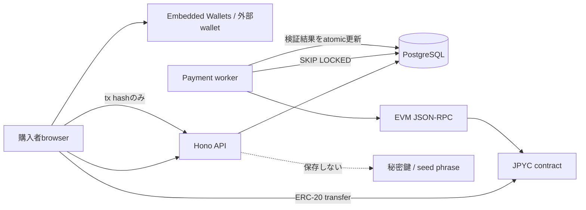
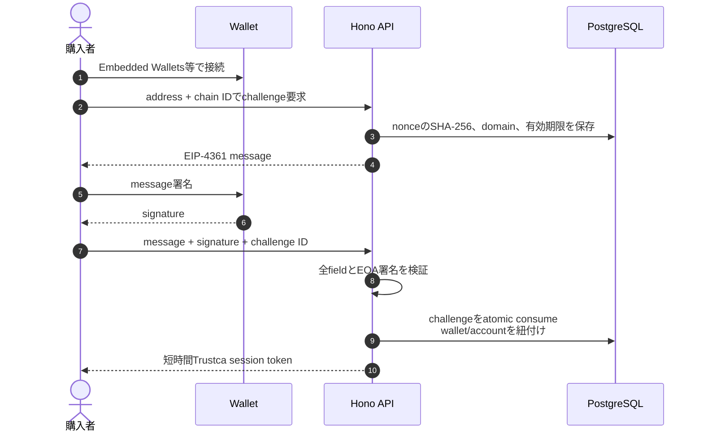
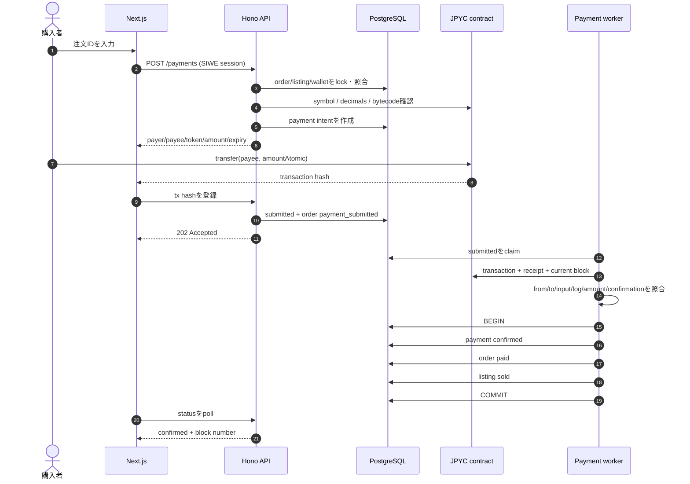
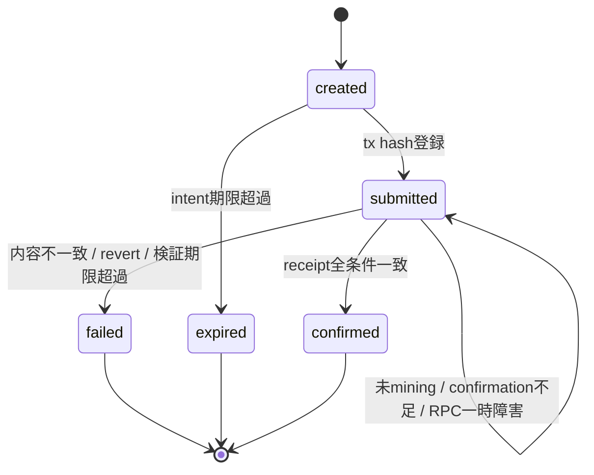

# JPYC決済・ウォレット認証MVP設計書

Issue [#18](https://github.com/study-basic-hackathon/trust-ca/issues/18) の設計・実装契約を定義する。参考実装は[WHXisWH/Node-Stay](https://github.com/WHXisWH/Node-Stay)だが、Trustcaでは秘密鍵を預からない購入者から販売者への直接送金、EIP-4361準拠のSIWE、PostgreSQLを正本とする非同期receipt検証へ置き換える。

本書の情報基準日は2026年8月13日。JPYCのcontract address、対応chain、法的な取扱いは本番反映前に公式情報を再確認する。

---

## 1. 結論

- ウォレット導入にはMetaMask Embedded Wallets（旧Web3Auth）のReact SDK v11を使用する。
- ログイン事実をclientから信用せず、backendが発行した使い捨てchallengeへのSIWE署名を検証する。
- MVPの支払いは購入者walletから販売者walletへのJPYC `transfer`とし、Trustcaは資金・秘密鍵を保管しない。
- 注文金額、payer、payee、chain、token、decimalsを`payment_intents`へsnapshotとして固定する。
- browserから申告されたtransaction hashだけでは支払済みにしない。workerがreceipt、送信元、contract、calldata、`Transfer` event、金額、確定数を照合する。
- 支払い確定時は`payment_intents=confirmed`、`orders=paid`、`listings=sold`を1つのDB transactionで更新する。
- 本番でエスクロー、代理送金、自動返金を導入する場合は、実装前に法務・資金管理・鍵管理の設計をやり直す。

---

## 2. 公式情報と採用version

| 項目 | MVPでの扱い | 公式参照先 |
|---|---|---|
| Embedded Wallets | `@web3auth/modal` v11。名称変更後もpackage名はWeb3Authを含む | [MetaMask Embedded Wallets](https://docs.metamask.io/embedded-wallets/)、[React SDK](https://docs.metamask.io/embedded-wallets/sdk/react/) |
| SIWE | EIP-4361 messageをbackendで生成・照合し、EOA署名をERC-191として検証 | [EIP-4361](https://eips.ethereum.org/EIPS/eip-4361) |
| JPYC | 2025年開始の電子決済手段JPYCを対象とし、旧前払式JPYCと混同しない | [JPYC EX正式リリース](https://corporate.jpyc.co.jp/news/posts/jpyc-ex-launch)、[JPYC公式GitHub](https://github.com/jpycoin) |
| Polygon mainnet | chain ID `137`。2026-08-13時点の公式addressは`0xE7C3D8C9a439feDe00D2600032D5dB0Be71C3c29` | [JPYC公式GitHub](https://github.com/jpycoin) |

contract addressはsource codeへ埋め込まず、`PAYMENT_JPYC_TOKEN_ADDRESS`で明示する。起動時にchain ID、bytecode、`symbol`、`decimals`を実chainから検証する。金額換算でdecimalsを18と決め打ちしない。

---

## 3. 対象範囲

### 3.1 MVPで実装するもの

1. Embedded Wallets / 外部walletを受け入れるNext.js demo UI
2. SIWE challenge発行、署名検証、短時間session token
3. 注文からJPYC payment intentを作成するAPI
4. ERC-20 `transfer`送信とtransaction hash登録
5. PostgreSQLの非同期検証queue、複数worker間の排他、再試行
6. receipt、calldata、`Transfer` event、confirmationの照合
7. local chain用`MockJPYC`とDocker Compose profile
8. unit test、migration統合テスト、SIWE→JPYC→DB状態遷移のE2E

### 3.2 MVPの対象外

- Trustcaによる秘密鍵・seed phrase・JPYC残高の保管
- エスクローcontract、代理送金、gas sponsorship、自動返金
- JPYC EXでの発行・償還、銀行口座との連携
- EIP-1271 smart contract walletのSIWE検証
- 販売者ごとの受取wallet選択画面
- dispute、配送完了、所有権移転、監査outboxの自動生成
- mainnet deployと実資金でのテスト

---

## 4. 全体構成



Embedded Walletsはwallet接続手段であり、Trustcaの認可根拠ではない。認可根拠はbackendが検証したSIWE署名と、その結果として発行するTrustca sessionである。

---

## 5. 認証フロー



### 5.1 challengeの制約

- backendがmessage全体を生成する。client側でdomain、URI、nonce、有効期限を組み立てない。
- DBにはnonce本文ではなくSHA-256を保存する。
- challenge IDをEIP-4361の`request-id`へ入れる。
- `domain`、`uri`、address、chain ID、version、statement、nonce、issued-at、expiration-timeを発行記録と完全照合する。
- consumeは`used_at IS NULL AND expires_at > now()`を条件に1 statementで行い、再利用を拒否する。
- address単位で1分5回までに制限する。
- EOA署名だけをMVP対象とする。EIP-1271が必要になった時点でchain stateを使う検証とsession失効方針を追加する。

### 5.2 session

- HS256、issuer `trustca`、audience `trustca-api`、1時間を初期値とする。
- `sub=user ID`、wallet address、chain IDを署名済みclaimへ入れる。
- UIではtokenをReact memoryだけに保持し、`localStorage`へ永続化しない。
- 本番ではsecretをSecret Managerへ保存し、rotationと全session失効手順を用意する。

`wallet_accounts.provider='web3auth'`は初回接続経路のmetadataであり、本人性を保証するauthorityではない。SIWEが証明するのもwalletの管理権限であり、公的な本人確認はeKYCの責務である。

---

## 6. 支払いフロー



### 6.1 payment intent作成条件

- session userがorderのbuyerである。
- orderは`pending_payment`、listingは`reserved`である。
- orderは`JPY`建てで、`price_minor > 0`である。
- session walletが同じchainの有効な`wallet_accounts`と一致する。
- MVPでは販売者に同chainの有効walletがちょうど1つ存在する。
- payerとpayeeが異なる。
- `amountAtomic = price_minor × 10^tokenDecimals`。JPYは小数単位を持たない前提である。
- 同じorderに同条件のopen intentがあれば同じIDを返し、条件が変わっていれば`409`とする。

販売者walletが複数になった時点で、推測による先頭選択はせず`payout_wallet_id`をseller設定またはorderへ明示的にsnapshotする。

### 6.2 chain上で確認する項目

| 確認対象 | 条件 |
|---|---|
| chain | worker設定のchain IDとintentのchain IDが一致 |
| token | transactionの`to`が設定済みJPYC contract |
| payer | transactionの`from`がintentの支払元 |
| calldata | functionが`transfer`、引数のtoとamountが完全一致 |
| receipt | `status=success` |
| event | 同じJPYC contractの`Transfer(from,to,value)`が完全一致 |
| confirmation | 設定数以上のblockが確定 |
| tx hash | 同chainで一度しか利用できない |

eventだけではproxyや別function経由の意図しない処理を許す可能性があり、calldataだけでは実transferを保証できない。そのため両方を確認する。

---

## 7. 状態遷移



| payment | order | listing | 意味 |
|---|---|---|---|
| `created` | `pending_payment` | `reserved` | 送金条件を提示済み |
| `submitted` | `payment_submitted` | `reserved` | tx申告済み、未確定 |
| `confirmed` | `paid` | `sold` | chain検証済み |
| `failed` | `pending_payment` | `reserved` | 再度intent作成可能 |

送金後に検証期限を超えて`failed`となったtransactionが後からminingされる可能性は残る。MVPでは1時間確認し、期限超過は運営確認対象とする。本番ではtransaction replacement、mempool滞留、再支払いとの二重入金を扱う照合・返金運用が必要である。

---

## 8. API

| Method / Path | 認証 | 用途 | 成功status |
|---|---|---|---|
| `POST /api/v1/wallet-auth/challenges` | 不要 | SIWE message発行 | `201` |
| `POST /api/v1/wallet-auth/verifications` | 不要 | 署名検証・session発行 | `200` |
| `POST /api/v1/payments` | Wallet session | orderからintent作成 | 新規`201`、再送`200` |
| `POST /api/v1/payments/:id/submissions` | Wallet session | tx hash登録 | `202` |
| `GET /api/v1/payments/:id` | Buyer / seller session | 検証状態取得 | `200` |

### 8.1 challenge作成

```json
{
  "address": "0x70997970c51812dc3a010c7d01b50e0d17dc79c8",
  "chainId": 31337
}
```

### 8.2 payment intent

```json
{
  "data": {
    "id": "44a00a03-5a09-4124-a49c-2b52fb9b8f8c",
    "orderId": "4cfd924a-709d-4d3b-b1ab-adf6a7169579",
    "status": "created",
    "chainId": 31337,
    "tokenAddress": "0xe7f1725e7734ce288f8367e1bb143e90bb3f0512",
    "fromAddress": "0x70997970c51812dc3a010c7d01b50e0d17dc79c8",
    "toAddress": "0x3c44cdddb6a900fa2b585dd299e03d12fa4293bc",
    "amountAtomic": "12000000000000000000000",
    "tokenDecimals": 18,
    "expiresAt": "2026-08-13T01:00:00.000Z"
  }
}
```

`amountAtomic`はJavaScriptの安全整数上限を超えるため、APIでは10進文字列として扱う。

---

## 9. DB・worker

既存の`payment_intents`へ次を追加する。

| 列 | 用途 |
|---|---|
| `verification_attempt_count` | receipt検証試行回数 |
| `next_verification_at` | backoff後の次回実行時刻 |
| `locked_at` / `locked_by` | workerの論理lock |
| `block_number` | confirmed receiptのblock |
| `last_error_code` / `last_error_message` | PIIを含まない運用情報 |

workerは`FOR UPDATE SKIP LOCKED`でbatchをclaimし、RPC通信中にDB transactionを保持しない。一時errorは3秒から指数backoffし、最大5分とする。lock timeout後は別workerが回収できる。

---

## 10. Node-Stayからの移行判断

| Node-Stay | Trustca | 判断理由 |
|---|---|---|
| Web3Auth v10 | Embedded Wallets React SDK v11 | 現行SDKのprovider/hook構成へ更新 |
| clientのWeb3Auth login結果を利用 | backend発行SIWEを追加 | client identityを認可根拠にしない |
| nonceをprocess memoryへ保存 | PostgreSQLへhash保存・atomic consume | Cloud Run複数instanceと再起動に対応 |
| JWT session | issuer/audience/address/chain/期限を固定して採用 | API認可を短時間sessionへ統一 |
| JPYC decimalsを18で固定 | contractから取得しintentへsnapshot | token差替え・仕様差異による桁事故を防ぐ |
| approve + marketplace contract | buyerからsellerへの直接transfer | MVPでcustody・escrowを持たない |
| browser処理中心 | backend workerがreceiptを検証 | tab終了や改変clientに依存しない |
| tx hashを成功根拠にする | inputとeventを含むreceipt全体を検証 | 別送金・金額違い・revertを拒否 |

---

## 11. Security・運用上の注意

1. `PAYMENT_SESSION_SECRET`、RPC credentialはSecret Managerで管理し、frontendへ渡さない。
2. mainnet addressは公式sourceとblock explorerのbytecode・metadataを複数人で確認する。
3. CORSだけを認証として扱わない。payment APIは常にWallet sessionを検証する。
4. raw signature、session token、wallet秘密鍵、seed phraseをlogへ出さない。
5. transaction hash登録APIは同じhashの再利用と別hashへの差替えを拒否する。
6. status APIはbuyerまたはsellerだけが参照できる。
7. RPC障害を支払い失敗と即断せず、検証期限まで再試行する。
8. `MockJPYC`はlocal E2E専用であり、本番へdeployしない。
9. 直接送金はカード配送や返品とatomicではない。dispute・返金は別の業務フローとして設計する。
10. JPYCの組込み、手数料、資金移動、媒介、エスクローの該当性は本番前に専門家へ確認する。

2026-08-13の`pnpm audit --prod`では、backendとblockchainは既知脆弱性0件、frontendはEmbedded WalletsがXRP互換用に間接参照する`elliptic@6.6.1`のlow severity 1件が残る。patched versionは公開されていないため、EVM決済経路で当該XRP機能を使用しないことを確認した上で、`@web3auth/modal`更新時に[GHSA-848j-6mx2-7j84](https://github.com/advisories/GHSA-848j-6mx2-7j84)の解消を継続確認する。Next.jsを16.3.0へ更新し、`sharp`・`postcss`のhigh severityと`uuid`のmoderate severityは解消済みである。

---

## 12. ローカル検証

### 12.1 起動

```bash
cp .env.example .env
# PAYMENT_MVP_ENABLED=true と NEXT_PUBLIC_WEB3AUTH_CLIENT_IDを設定
docker compose --profile blockchain up --build
```

local chainでは次を使用する。

| 項目 | 値 |
|---|---|
| chain ID | `31337` |
| MockJPYC | `0xe7f1725e7734ce288f8367e1bb143e90bb3f0512` |
| 初期保有wallet | Hardhat account #1 |
| 初期残高 | `1,000,000 JPYC` |

### 12.2 自動E2E

backend container内で実行する。

```bash
docker compose exec \
  -e BACKEND_URL=http://localhost:8080 \
  -e PAYMENT_RPC_URL=http://chain:8545 \
  backend pnpm test:payment:e2e
```

E2Eは次を実際に検証する。

1. Hardhat accountでSIWE messageを署名する。
2. seller、wallet、card、listing、order fixtureをtransactionで作る。
3. payment intentを作成し、API再送時の冪等性を確認する。
4. MockJPYCで12,000 JPYCを送金する。
5. workerがreceiptを確認するまでstatusをpollする。
6. payment/order/listingが`confirmed/paid/sold`で同時に保存されたことをDBで確認する。
7. 作成したbusiness fixtureを削除する。buyerのwallet accountとchallenge監査は認証履歴として残る。

---

## 13. 本番移行条件

- Polygon mainnet RPCを冗長化し、rate limitと障害時切替を決める。
- official JPYC address、symbol、decimals、proxy有無をdeploy時に検証する。
- sellerが明示的に受取walletを設定・再署名できる画面と変更監査を追加する。
- Cloud Run APIとworkerを別service accountに分離する。
- workerのfailed、verification timeout、長時間submittedを監視・alert化する。
- session secret rotation、wallet無効化、account recoveryを実装する。
- EIP-1271を採用するか、非対応をUIで明示する。
- 返金・二重入金・誤送金・chain reorganization・token停止時の運用runbookを作る。
- 法務・会計・税務・利用規約・表示内容のreviewを完了する。
