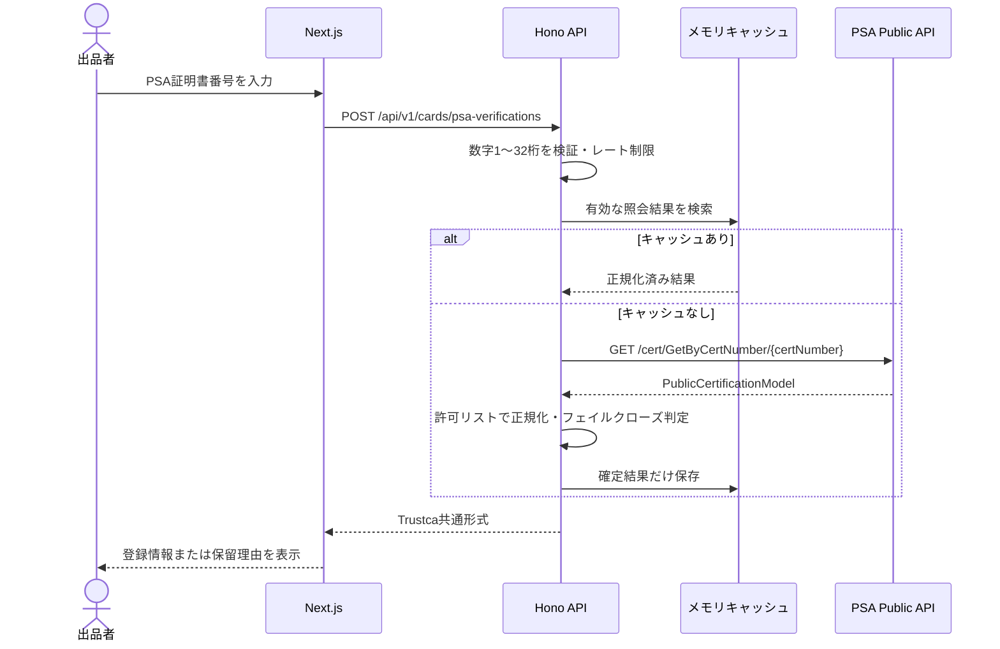

# PSA Public API照会MVP設計書

**基準日: 2026年8月13日**

**対応Issue: [#15 PSAのAPI調査、MVP実装](https://github.com/study-basic-hackathon/trust-ca/issues/15)**

本書は、出品者が入力したPSA証明書番号をTrustcaのバックエンドからPSA Public APIへ照会し、カード登録情報を出品審査へ引き渡すMVPの仕様と運用方法を定義する。外部API全体の棚卸しはIssue #20の別PRで扱う。

## 1. MVPの到達点と非目標

### 到達点

- ブラウザからTrustca backendへ証明書番号を送る。
- backendだけがPSAトークンを保持し、`GetByCertNumber`へサーバー間通信する。
- PSA固有のレスポンスをTrustcaの4状態へ正規化する。
- 登録カード名、年、ブランド、カード番号、バリエーション、グレード、個体数を日語UIへ表示する。
- タイムアウト、1回の再試行、24時間キャッシュ、同一番号の同時リクエスト集約、送信元単位の簡易レート制限を実装する。

### 非目標

- PSAケースやカード現物の真正性を保証すること。
- PSAの登録情報だけで出品を自動承認すること。
- Cloud SQLへ照会履歴を永続化すること。Issue #14のスキーマPR取り込み後に接続する。
- 本番用の認証・認可、分散レート制限、監査ログを完成させること。

PSA公式の証明書照会にも、証明書番号を確認するだけでは出品物の真正性を保証できない旨の注意がある。本MVPの表示は一貫して「PSA登録情報確認済み」とし、「本物」「真正性確認済み」とは表現しない。

## 2. 使用する公式API

| 項目 | 値 |
|---|---|
| 公式資料 | [PSA Public API Documentation](https://www.psacard.com/publicapi/documentation) |
| Swagger | [PSA Public API Swagger](https://api.psacard.com/publicapi/swagger.json) |
| Base URL | `https://api.psacard.com/publicapi` |
| Endpoint | `GET /cert/GetByCertNumber/{certNumber}` |
| 認証 | `Authorization: bearer <token>` |
| 用途 | 1つの証明書番号に対応するPSA/DNA登録情報の取得 |

PSAが公開する`PublicPSACert`のうち、MVPでは業務上必要なフィールドだけを許可リストで取り込む。未知の追加フィールドはAPIレスポンスへ転記しない。

## 3. 全体フロー



frontendはServer ActionおよびNext.js Route Handlerを経由せず、ブラウザからbackendへ直接`fetch`する。PSAトークンはbackendの環境変数だけに置く。

## 4. Trustca API契約

### `POST /api/v1/cards/psa-verifications`

リクエスト:

```json
{
  "certNumber": "12345678"
}
```

成功時の例:

```json
{
  "data": {
    "certNumber": "12345678",
    "status": "verified",
    "checkedAt": "2026-08-13T00:00:00.000Z",
    "expiresAt": "2026-08-14T00:00:00.000Z",
    "source": "psa",
    "cacheHit": false,
    "card": {
      "certNumber": "12345678",
      "year": "1999",
      "brand": "POKEMON GAME",
      "category": "TCG Cards",
      "cardNumber": "4",
      "subject": "CHARIZARD",
      "variety": "HOLO",
      "gradeDescription": "GEM MINT",
      "cardGrade": "10",
      "totalPopulation": 712,
      "populationHigher": 0
    }
  }
}
```

エラー形式:

```json
{
  "error": {
    "code": "PSA_API_UNAVAILABLE",
    "message": "PSAの登録情報を確認できませんでした。時間をおいて再度お試しください。"
  }
}
```

| HTTP | code | 条件 |
|---:|---|---|
| 200 | ― | PSA照会の業務結果を返した。`status`は承認を意味しない |
| 400 | `INVALID_REQUEST_BODY` | JSONとして読めない |
| 400 | `INVALID_CERT_NUMBER` | 1〜32桁の数字ではない |
| 429 | `RATE_LIMIT_EXCEEDED` | 送信元ごとの分間上限を超過 |
| 503 | `PSA_MVP_DISABLED` | 機能フラグが無効 |
| 503 | `PSA_API_CONFIGURATION_ERROR` | トークン未設定または401/403 |
| 503 | `PSA_AUTH_OR_SERVER_ERROR` | 再試行後もPSAが5xx。公式上、資格情報不備とサーバー障害の双方があり得る |
| 503 | `PSA_API_UNAVAILABLE` | タイムアウト、通信障害、不正JSON、その他の上流障害 |

## 5. 結果判定

| Trustca status | PSAレスポンス・条件 | UI表示 | 出品審査での扱い |
|---|---|---|---|
| `verified` | `PSACert.CertNumber`が要求番号と一致 | PSA登録情報確認済み | 登録情報の一致のみ確認。現物確認は別途必要 |
| `not_found` | `No data found`またはHTTP 404 | 登録情報が見つかりません | 自動承認しない |
| `invalid_request` | `IsValidRequest=false`、`Invalid CertNo`、HTTP 400/204 | 番号を確認してください | 入力修正を求める |
| `in_review` | `DNACert`のみ、番号不一致、未知の構造 | 自動確認できません | 必ず目視確認へ回す |

`verified`、`not_found`、`invalid_request`は24時間キャッシュする。`in_review`と通信エラーは、仕様変更や一時障害から回復できるようキャッシュしない。Cloud Runの複数インスタンス間では共有されないため、これはMVP限定の呼び出し削減策である。

## 6. 設定と起動

PSAからPublic APIトークンを取得し、リポジトリへコミットしないローカル`.env`へ設定する。

```dotenv
PSA_MVP_ENABLED=true
PSA_API_TOKEN=<PSAから発行されたトークン>
PSA_API_BASE_URL=https://api.psacard.com/publicapi
PSA_API_TIMEOUT_MS=5000
PSA_CACHE_TTL_SECONDS=86400
PSA_REQUESTS_PER_MINUTE=10
```

```bash
docker compose up --build
```

画面は`http://localhost:3000`、APIは`http://localhost:8080/api/v1/cards/psa-verifications`で確認する。トークンを設定できない環境でも、ユニットテストはモック上流で全状態を検証できる。

## 7. セキュリティ・運用上の制約

- `PSA_MVP_ENABLED`の既定値は`false`。認証未実装の公開環境で誤って有効化しない。
- トークンをログ、レスポンス、`NEXT_PUBLIC_*`環境変数へ出さない。本番ではSecret ManagerからCloud Runへ注入する。
- 簡易レート制限はプロセスメモリ内であり、複数インスタンスを横断しない。本番前にAPI Gateway/Cloud Armorまたは共有ストア方式へ置き換える。
- 取得結果を利用しても、現物画像、ケース、ラベルのすり替えは検知できない。Vision API等の物理商品確認と組み合わせる。
- DB永続化はIssue #14の`psa_verifications`テーブルを取り込んだ後、問い合わせキャッシュ兼監査履歴として実装する。

## 8. 検証範囲

- 正常レスポンスの許可リスト正規化
- 未登録、不正番号、DNAのみ、番号不一致、未知構造のフェイルクローズ
- BearerヘッダーとURL組み立て
- 429/ネットワーク障害の1回再試行、401の再試行禁止
- 24時間キャッシュと同一番号の同時リクエスト集約
- APIの入力検証、機能フラグ、設定不足、上流障害、レート制限
- frontend/backendのlint、型検査、ビルド
- モックPSAサーバーを使ったブラウザからのE2E疎通
