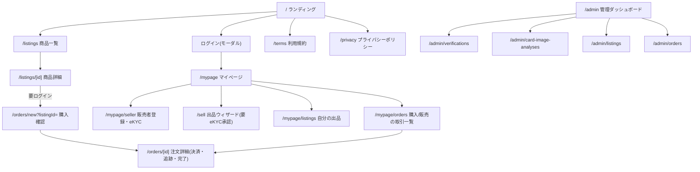

# 画面設計書

**基準日: 2026年8月20日**

本書は、Trustcaの全画面のレイアウト・遷移・状態・共通コンポーネント・文言方針を定義する。実装は本書に従い、乖離が必要になった場合は先に本書を更新する。業務ロジックの配置は[folder-structure.md](./folder-structure.md)(業務判定はすべてbackend)、API契約は[api-catalog.md](./api-catalog.md)に従う。

対象読者: フロントエンド実装者、デザインレビュー担当者。

---

## 1. デザイン方針

### 1.1 ブランド基調

Trustcaは「**入口で審査する、安心・安全のカード取引**」を訴求する([trustca-market-research.md](../research/trustca-market-research.md)のポジショニング)。UIは次の基調で統一する。

- **ライトテーマ基準**。清潔感・可読性を最優先し、ダーク調のWeb3的演出(ネオン・グラデーション過多)は使わない
- 信頼を示す寒色(ブルー系)をプライマリに、検証済みシグナルにグリーン、注意・審査中にアンバー、拒否・エラーにレッド
- 「鑑定済み」「保証」等の誇張表現を使わない。バッジ文言は確認できた事実のみ(「PSA登録情報確認済み」等。api-catalog.md §2.2)
- 全文言は日本語。です・ます調。エラーは原因+次の行動を必ず併記

### 1.2 デザイントークン

Tailwind CSS v4のテーマ変数として定義する(`frontend/src/app/globals.css`)。shadcn/uiのHSL変数体系に乗せる。

| トークン | 値(ライト) | 用途 |
|---|---|---|
| `--background` | `#fafaf9`(warm white) | ページ背景 |
| `--foreground` | `#1c1917` | 本文 |
| `--card` | `#ffffff` | カード・パネル |
| `--primary` | `#1d4ed8`(blue-700) | 主ボタン・リンク・アクティブ |
| `--primary-foreground` | `#ffffff` | 主ボタン文字 |
| `--secondary` | `#f5f5f4` | 副ボタン背景 |
| `--muted` / `--muted-foreground` | `#f5f5f4` / `#78716c` | 補足・無効 |
| `--accent` | `#eff6ff`(blue-50) | ホバー・選択行 |
| `--destructive` | `#dc2626` | 削除・拒否 |
| `--success` | `#16a34a` | 検証済み・承認 |
| `--warning` | `#d97706` | 審査中・要確認 |
| `--border` / `--input` | `#e7e5e4` | 罫線・入力枠 |
| `--radius` | `0.75rem` | 角丸 |

- フォント: `Inter` + `Noto Sans JP`(next/font)。見出しはweight 700、本文400、数値・Cert番号・tx hashは等幅(`ui-monospace`)
- 影は控えめ(`shadow-sm`基準)。信頼シグナル系バッジのみ色付き薄背景+同色ボーダー

### 1.3 共通UIコンポーネント(shadcn/ui + 自作)

| コンポーネント | 由来 | 用途 |
|---|---|---|
| Button / Input / Select / Textarea / Checkbox / Label | shadcn/ui | フォーム全般 |
| Card / Badge / Alert / Skeleton / Separator / Table / Tabs / Dialog / Sheet / Sonner(toast) | shadcn/ui | パネル・通知・一覧・モーダル |
| `TrustBadge` | 自作 | 信頼シグナル表示。種類: `本人確認済み`(green)/`PSA登録情報確認済み`(blue)/`画像解析済み`(blue)/`審査中`(amber)/`要確認`(amber) |
| `StatusStepper` | 自作(poc/ekyc FlowStepper踏襲) | eKYC・取引の段階表示 |
| `EventTimeline` | 自作(poc/ekyc踏襲) | 状態変化履歴(いつ・何が・どの経路で) |
| `AmountJpy` | 自作 | `price_minor`→「12,000 JPYC」表示。小数を出さない |
| `AddressText` | 自作 | EVMアドレス・tx hashの短縮表示+コピー+explorerリンク |
| `EmptyState` | 自作 | 空一覧(アイコン+説明+主導線) |

### 1.4 画面状態の共通規則

すべてのデータ表示画面は次の4状態を実装する。

1. **ローディング**: Skeleton(レイアウト維持)。スピナー単独は使わない
2. **空**: EmptyState(次の行動への導線付き)
3. **エラー**: Alert(destructive)+「再試行」ボタン。backendの`error.message`(日本語)をそのまま表示し、`error.code`は表示しない
4. **正常**: 本体

フォーム送信は: 送信中disabled+ラベル変化(「登録する」→「登録中…」)、成功はtoast+遷移、失敗はフォーム上部Alert。破壊的操作(出品close・却下等)は必ずDialogで確認。

---

## 2. サイトマップと権限



| 画面群 | 認可 |
|---|---|
| `/`, `/listings*`, `/terms`, `/privacy` | 公開 |
| `/mypage*`, `/sell`, `/orders*` | wallet session必須(未ログインはログインモーダルへ) |
| `/sell` | さらに eKYC `approved` 必須(未承認は `/mypage/seller` へ誘導) |
| `/admin*` | ADMIN_API_TOKEN入力(既存方式)。一般ナビには出さない |

ヘッダー(全画面共通): ロゴ / 商品を探す / 出品する / (ログイン後)マイページ・wallet短縮表示・ログアウト。フッター: 利用規約・プライバシーポリシー・「本サービスの表示は確認できた事実のみを示し、真贋を保証するものではありません」の注記。

---

## 3. 画面仕様

### 3.1 ランディング `/`

目的: 「事前審査型」の価値を30秒で伝え、購入者は一覧へ、販売者は登録へ導く。

構成(上から):
1. **ヒーロー**: 見出し「出品前に、審査する。」/ サブ「Trustcaは販売者の本人確認とカード検証を出品前に行う、高額トレーディングカードのC2Cマーケットプレイスです」/ CTA2つ(「商品を探す」primary → /listings、「販売者になる」outline → /mypage/seller)。右側に商品カードのモック(信頼バッジ付き)
2. **課題提起**: 偽物・状態虚偽・不正アカウントの3課題を3カラムで
3. **仕組み**: 4ステップ図(本人確認 eKYC → カード検証 PSA/画像 → JPYC決済 → 追跡・完了)。「既存サービスは実績を待つ。Trustcaは入口で審査する。」の対比表
4. **信頼シグナルの説明**: TrustBadge各種が何を確認した事実なのか(誇張しない説明)
5. **CTA再掲+フッター**

### 3.2 ログイン(モーダル、全画面から起動)

二重入口をタブで提示。

- タブ①「ソーシャルログイン」: 説明「ウォレットをお持ちでなくても、普段のアカウントで始められます」+ボタン: Googleで続ける / Discordで続ける / Xで続ける → Web3Auth Modal(組込みウォレットが自動発行される旨の一文)
- タブ②「ウォレット接続」: MetaMask等のinjectedウォレット接続
- 接続後共通: 「安全のため、署名でログインを完了します(ガス代不要)」→ SIWE署名 → `POST /api/v1/wallet-auth/verifications` → session取得 → toast「ログインしました」
- 状態: 接続中 / 署名待ち / 検証中 / エラー(署名拒否: 「署名がキャンセルされました。ログインには署名が必要です」)
- セッションはメモリ保持(jpyc-payment.md §5.2)。リロード時はWeb3Auth/wagmiの再接続 → 再署名なしでは`セッション切れ`扱いとし、操作時に再署名を促す

### 3.3 マイページ `/mypage`

- 上部: アカウントカード(wallet短縮表示・接続方式(ソーシャル/ウォレット)・登録日)
- 販売者ステータスカード: 未登録 →「販売者登録へ」/ 登録済み → eKYC状態のStatusStepper(登録→本人確認→審査→承認)+ TrustBadge。`in_review`は「運営が確認しています(通常1営業日)」
- ショートカット: 出品する(承認時のみ活性)/ 自分の出品 / 取引一覧

### 3.4 販売者登録・eKYC `/mypage/seller`

1. 未登録: 表示名入力フォーム+利用規約同意チェック → `POST /api/v1/sellers`(認証必須化後はsessionのuserへ紐付け)
2. 登録済み・eKYC未実施: 「本人確認を開始」ボタン → `POST .../kyc-sessions` → Didit Hosted Flowへ遷移。注意文「身分証明書と顔の撮影が必要です。情報は認証事業者(Didit)にのみ保存されます」
3. コールバック `/mypage/seller/callback`: 「確認結果を取得しています…」→ statusをrefresh→ /mypage/seller へ
4. 状態表示: StatusStepper + EventTimeline(poc/ekyc踏襲)。declined時は理由と「やり直す」導線

### 3.5 出品ウィザード `/sell`(4ステップ)

前提ガード: eKYC未承認は入口で「本人確認完了後に出品できます」+導線。

- **Step1 カード情報**: カード名 / 年 / ブランド / カード番号 / グレード表記(任意) / PSA鑑定の有無(ラジオ) / 価格(JPYC、整数のみ) / 説明
- **Step2 画像**: 表面・裏面(必須)+ラベル・四隅(PSAなし時必須)。`POST /api/v1/uploads/card-images` → GCS直接PUT → 完了登録。各画像はプレビュー+削除+再アップロード
- **Step3 検証**:
  - PSAあり: Cert番号入力 → `POST /api/v1/cards/psa-verifications` → 結果カード(登録情報とStep1入力の一致・不一致をハイライト)。`verified`以外は次へ進めるが「審査扱いになります」表示。重複Certはこの時点で409を表示
  - PSAなし: `POST /api/v1/card-image-analyses` → 解析結果(OCR候補と入力の整合)。`要確認`は同様に注記
- **Step4 確認**: 全入力+検証結果+手数料注記(本期は0)+「出品する」→ `POST /api/v1/listings` → 完了画面(公開された商品へのリンク)
- ウィザード状態はメモリ保持(途中離脱で破棄されることを明記)。各Stepのバリデーションエラーはインライン表示

### 3.6 商品一覧 `/listings`

- 検索バー(カード名)+フィルタ(PSA有無 / 価格帯 / グレード)+並び順(新着・価格)
- カードグリッド: 画像 / カード名 / グレード / 価格(AmountJpy)/ TrustBadge群 / 販売者表示名
- ページング: `limit + cursor`(api-catalog §6.1)で「もっと見る」方式
- 空: 「条件に合う商品がありません」

### 3.7 商品詳細 `/listings/[id]`

- 左: 画像ギャラリー(拡大Dialog)
- 右: カード名・グレード・価格・**信頼シグナルパネル**(TrustBadgeごとに「何を確認したか」の説明行。PSAはCert番号+照会日時、画像解析は実施日時)・販売者カード(表示名+本人確認済みバッジ)・「購入手続きへ」(自分の出品なら非表示+「自分の出品です」)
- 下部: 説明 / 注意事項(「表示は確認できた事実であり、真贋を保証するものではありません」)
- 状態: `active`以外は「この商品は現在購入できません(取引中/販売終了)」

### 3.8 購入確認 `/orders/new?listingId=`

- 商品サマリ+価格+支払方法(JPYC固定。chain・残高表示、残高不足は警告)
- **配送先入力**: 氏名 / 郵便番号 / 都道府県 / 市区町村 / 番地・建物 / 電話番号。注記「配送先は本取引の当事者と運営者のみが参照できます。取引完了後90日で削除されます」
- 「注文を確定する」→ `POST /api/v1/orders`(listing reserve)→ 注文詳細へ。reserve競合(409)は「他の方が購入手続き中です」

### 3.9 注文詳細 `/orders/[id]`(取引の中心画面)

上部に**取引ステッパー**: 注文 → 支払い → 発送 → 受領 → 完了。orderの状態で進行。

役割(購入者/販売者)により同一URLで表示を切替える。

- **支払い(購入者・pending_payment)**: payment intent作成 → 金額・宛先表示 → 「JPYCで支払う」(wallet transfer)→ tx hash登録 → 「支払いを確認しています…」(ポーリング。confirmed까지)。失敗時は理由+再試行
- **発送待ち(販売者・paid)**: 配送先表示+発送登録フォーム(キャリア選択: ヤマト運輸/佐川急便/日本郵便/その他+追跡番号)→ shipped
- **追跡(双方・shipped)**: キャリア名+追跡番号(コピー+公式追跡ページへの外部リンク)+EventTimeline
- **受領確認(購入者・shipped)**: 「商品を受け取りました」→ 確認Dialog(「受領確認後、取引が完了します」)→ delivered→completed
- **完了(双方・completed)**: **取引完了画面**(丁寧に): お祝いメッセージ / 取引サマリ(商品・金額・当事者・日時)/ 信頼シグナルの再掲 / 監査記録カード(audit event + anchor tx hashのexplorerリンク「この取引の記録は改竄検知可能な形で保存されています」)/ 「商品一覧へ戻る」
- 決済のtx hash・anchor txはAddressTextで表示

### 3.10 取引一覧 `/mypage/orders`

Tabs: 購入した商品 / 販売した商品。各行: 商品名・相手表示名・金額・状態Badge・更新日時 → 注文詳細へ。

### 3.11 自分の出品 `/mypage/listings`

各行: 商品・価格・状態(draft/active/reserved/sold/closed)・作成日。activeは「公開停止」(Dialog確認→close)。

### 3.12 利用規約 `/terms`・プライバシーポリシー `/privacy`

静的ページ。プライバシーポリシーには: eKYC情報はDidit側保存でTrustcaはPII非保持(ekyc-design.md原則2)、配送先の保存範囲と90日削除、walletアドレスの取扱い、を明記。

### 3.13 管理コンソール `/admin`

- 入口: ADMIN_API_TOKEN入力(既存方式踏襲。メモリ保持)
- ダッシュボード: 4カード(eKYC審査待ち件数 / 画像解析要確認件数 / 公開中出品数 / 進行中取引数)→ 各一覧へ
- `/admin/verifications`(既存): in_review一覧+承認/却下(理由必須)
- `/admin/card-image-analyses`(既存): 要確認一覧
- `/admin/listings`(新規): 全出品一覧(状態フィルタ)+強制close(理由必須・Dialog)
- `/admin/orders`(新規): 全取引一覧(状態フィルタ)+詳細(配送先を含む全状態。参照は運営者権限)

---

## 4. 文言方針(抜粋)

| 場面 | 文言 |
|---|---|
| PSA照会成功 | 「PSA登録情報確認済み」(「本物」「保証」は使わない) |
| 画像解析成功 | 「画像解析済み(内容整合)」 |
| eKYC承認 | 「本人確認済み」 |
| in_review | 「運営が確認しています。結果までしばらくお待ちください」 |
| 決済検証中 | 「ブロックチェーン上で支払いを確認しています。通常1〜2分かかります」 |
| 完了画面 | 「お取引ありがとうございました。この取引の記録は改竄を検知できる形で保存されています」 |
| 汎用エラー | 「時間をおいて再度お試しください。解決しない場合は運営までご連絡ください」 |

---

## 5. 実装構成(folder-structure.md準拠)

```
frontend/src/
├── app/
│   ├── layout.tsx / globals.css(トークン)
│   ├── page.tsx(LP)
│   ├── listings/ page.tsx・[listingId]/page.tsx
│   ├── sell/ page.tsx(ウィザード)
│   ├── orders/ new/page.tsx・[orderId]/page.tsx
│   ├── mypage/ page.tsx・seller/(page・callback)・listings/・orders/
│   ├── terms/・privacy/
│   └── admin/(既存+listings・orders)
├── components/
│   ├── ui/(shadcn)
│   ├── trust-badge.tsx・status-stepper.tsx・event-timeline.tsx・amount-jpy.tsx・address-text.tsx・empty-state.tsx
│   ├── auth/(login-dialog.tsx・auth-provider.tsx・session-guard.tsx)
│   └── layout/(header.tsx・footer.tsx)
├── lib/
│   ├── api.ts(既存拡張: session付きfetch)
│   ├── api/(listings.ts・orders.ts・shipments.ts・sellers.ts・payments.ts 等)
│   ├── auth/(web3auth.ts・siwe.ts)
│   └── stores/(auth-store.ts)
```

- Web3Auth初期化はNode-Stayの`web3auth.service.ts`パターン(遅延singleton・modalConfigでソーシャルのみ表示、外部walletはwagmi injectedで別導線)を踏襲し、SDKは`@web3auth/modal` v11(既存frontend依存)を使用
- 業務判定(出品可否・価格・状態遷移)はすべてbackendレスポンスに従い、フロントで再実装しない

---

## 6. 追補(2026-08-21): 不足画面の設計

初期実装後のギャップ分析に基づく追加画面。実装は本節に従う。

### 6.1 nonce付き所持証明(出品ウィザード Step2.5)

- 画像アップロード(Step2)完了後、「所持確認」ステップを挿入する
- backendが発行する確認コード(例: `PKM-7Q4M`、有効期限15分)を大きく表示し、「このコードを紙に書き、カードと同じ写真に収めて撮影してください」と案内する
- アップロード枠は1つ(`imageKind=possession`、`captureNonce`にコードを保存)
- 検証: nonceの有効期限内であることをbackendが確認。画像内容の目視確認は運営者審査(6.5)へ委ねる
- スキップ不可。所持証明のない出品は作成できない

### 6.2 到着後の再撮影比較(受領確認の前段)

- 注文詳細の購入者ビュー(shipped)で、「商品を受け取りました」の前に「到着した商品を撮影してください」を挿入する
- 表面1枚を必須(`uploadContext=arrival`)。アップロード後にVision解析を実行し、出品時画像との内容整合(カード名・番号)を表示する
- 解析結果が`要確認`でも受領確認は可能とする(判定は補助シグナル)。結果は取引詳細と運営者画面の両方へ記録する

### 6.3 注文キャンセル(支払い前)

- 注文詳細(pending_payment)の購入者ビューに「注文をキャンセル」(outline・確認Dialog付き)
- 遷移: order `pending_payment→cancelled` + listing `reserved→active`(同一transaction)
- 支払いsubmitted以降はキャンセル不可(文言で案内)

### 6.4 紛争(問題の報告)フロー

- 購入者の注文詳細(paid/shipped/delivered)に「問題を報告する」(控えめなリンク)
- 報告Dialog: 理由選択(未着 / 商品が説明と異なる / 偽物の疑い / その他)+ 自由記述(必須・1000字)
- 遷移: order → `disputed`。以後の発送登録・受領確認は不可(409)
- 双方の注文詳細に「調査中」バナー(運営からの連絡を待つ旨)を表示
- 運営者: `/admin/orders` の詳細から `返金済み(refunded)` または `調査終了(却下=元の状態へ復帰)` を選択(理由必須)。判断は監査イベント(`order.disputed` / `order.dispute_resolved`)として記録する

### 6.5 出品の公開前審査(条件付き)

- 出品作成時にRisk判定(6.7)が`要確認`の場合、listingを`draft`のまま保留し「運営の確認後に公開されます」と表示する
- 運営者: `/admin/listings` に「審査待ち(draft)」フィルタと「公開する/却下する」操作を追加
- 低リスク出品は従来通り即時公開(事前審査の理念とUX速度の両立)

### 6.6 通知欄(アプリ内通知)

- MVPはメール送信を行わず、ヘッダーのベルアイコン+ドロップダウンで代替する
- 対象イベント: 支払い確定(販売者へ)/ 発送(購入者へ)/ 受領・取引完了(販売者へ)/ eKYC結果 / 紛争関連
- 実装: `notifications` テーブル(user_id, type, order_id等, read_at)。ポーリングで未読数を表示

### 6.7 Risk Engine(最小ルール版)

画面はないが公開前審査(6.5)の判定元として定義する。ルールは環境変数で調整可能にする:

1. 新規販売者(取引完了実績0)の出品額が閾値(既定50,000円)超 → `要確認`
2. 同一販売者の直近24時間の出品数が閾値(既定5件)超 → `要確認`
3. PSA照会が`verified`以外のPSAあり出品 → `要確認`(現行の審査扱い表示を公開保留に格上げ)

### 6.8 admin: seller_limits調整

- `/admin/sellers`(新規): 販売者一覧(表示名・eKYC状態・取引実績・現在の上限)
- 行内で `active_listing_limit` / `max_listing_amount_minor` を編集(段階的信頼の運用手段)
- 変更は監査イベントとして記録する

### 6.9 一覧・詳細の充実(既存設計の未実装分)

- 商品一覧: 価格帯(下限・上限)入力と並び替え(新着 / 価格が安い順 / 高い順)を実装する
- 商品詳細: メイン画像クリックで拡大Dialog(全画像をナビゲーション可能)

---

## 7. 視覚デザイン刷新指針(2026-08-21)

現状の「shadcn既定の羅列」から、ブランドの視覚的記憶点を持つUIへ引き上げる。「安心・安全」のライトテーマ基調は維持する。

### 7.1 デザイントークン拡張

- **ブランド色の彫り込み**: primaryを`#1d4ed8`単色から、信頼のネイビー`#1e3a8a`〜ブルー`#2563eb`のグラデーション帯へ。アクセントに「鑑定の金」`#b45309`(バッジ・強調のみ、面積小)
- 背景に極薄いブルーグレー`#f6f8fb`、カードは純白+`shadow-sm→hover:shadow-md`遷移
- 見出しは`Noto Sans JP`の700を明示的に大きく(display: clamp(1.75rem, 3vw, 2.5rem))、本文との級差を強調
- 角丸は現行0.75rem維持。境界線は薄く、面と余白で区切る

### 7.2 コンポーネント指針

- **商品カード**: 画像主導(実画像をaspect-[4/3]で表示、なければブランドパターンのプレースホルダ)。ホバーで軽い浮上+画像ズーム(scale-105, 300ms)
- **信頼バッジ**: 現行を維持しつつ、詳細ページでは「確認済み事実パネル」をカード枠+左ボーダー色で格上げ
- **ヒーロー**: 実物スラブ写真風のモック(CSS製の傾いたカード+ラベル)+背景に極薄い格子/グラデーション
- **完了画面**: チェックマークのスケールイン(framer-motion)、監査記録カードを金色ボーダーで儀式感
- **ステッパー/タイムライン**: 現行踏襲、activeのパルスは維持

### 7.3 モーション規約

- `framer-motion`を導入。原則: 入場はfade+8px上昇(200ms, easeOut)、リスト項目は30msずつstagger、レイアウトシフトを伴うアニメーションは禁止
- 完了・承認などの成功時のみcelebration的動き(スケールイン)を許可。過剰な常時アニメーションは使わない

### 7.4 表現の禁止事項(再掲)

ネオン・ダークWeb3調・グリッチ表現は使わない。誇張文言の禁止は§1.1の通り。
