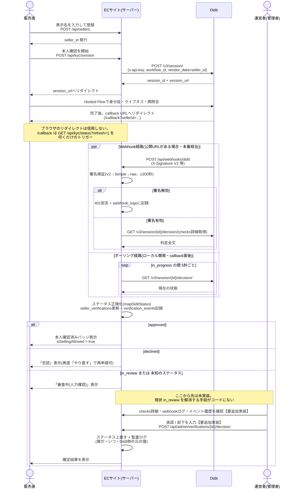
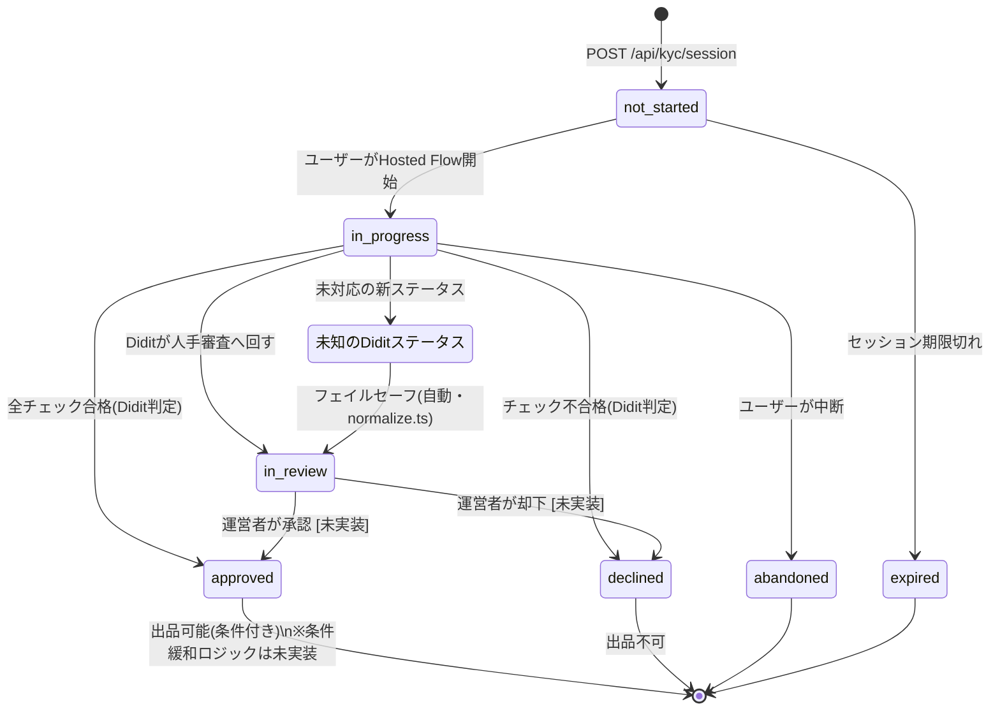

# 販売者登録〜審査 全体フロー

**基準日: 2026年8月6日**

[README.md](../README.md) 3.2節のシーケンス図は、Diditとの通信だけを切り出した図である。本書はそれを内包しつつ、**販売者登録の開始から出品可否が確定するまでの全体像**を描く。特に、Diditの判定だけでは決着しない `in_review` / 未知ステータスをどう解消するか(=運営者による人手審査)を明確化する。

対象読者: この実装(`ekyc/`)に手を入れる開発者、デモの審査フローを設計する担当者。

---

## 1. 全体像(サマリ)

```
販売者登録 → KYCセッション作成 → Diditホスト画面で本人確認
  → 結果受信(Webhook / ポーリング) → ステータス正規化・DB保存
  → ┬ approved  → 本人確認済みバッジ(条件付き出品可)
    ┼ declined  → 登録拒否
    └ in_review / 未知の値 → 運営者による人手審査 → 承認 or 却下
```

ポイントは3つ。

1. **結果の真実のソースはサーバー間通信のみ**(README 2.1 原則1)。ブラウザの `/callback` 遷移は「結果を取りに行くきっかけ」にすぎない。
2. **未知の状態は自動承認しない**(README 2.1 原則3)。判定できないものは必ず `in_review` に落ち、最終的に人間が判断する。
3. **`in_review` を解消する経路(運営者の人手審査)は、README上は設計されているが、コードとしては未実装**。これが本書で最も重要な指摘であり、4節・5節で扱う。

---

## 2. 全体シーケンス図

`README.md` 3.2節の図に、①ブラウザcallbackの位置づけと②運営者による人手審査を明示的に足したもの。



---

## 3. 状態遷移図(運営者による確定を含む)

README 2.3節の状態図に、`in_review` を抜け出す遷移の主体(運営者)と、未知ステータスの扱いを明示した版。



`approved`/`declined` の分岐自体はDiditの判定で完結する。運営者が関与するのは **`in_review`(人手審査中)と、正規化ロジックが解釈できず `in_review` に落ちた未知ステータスだけ**であり、これは意図的な設計(README 2.1 原則3)である。

---

## 4. 実装状況(コード確認済み)

| 段階 | 内容 | 状況 | 該当ファイル |
|---|---|---|---|
| 販売者登録 | 表示名でseller作成 | ✅ | [sellers/route.ts](../ekyc/src/app/api/sellers/route.ts) |
| KYCセッション作成 | Didit `/v3/session/` 呼び出し | ✅ | [kyc/session/route.ts](../ekyc/src/app/api/kyc/session/route.ts), [client.ts](../ekyc/src/lib/didit/client.ts) |
| Hosted Flow | 身分証・ライブネス・顔照合(Didit側) | ✅(外部サービス) | — |
| callback | ブラウザ結果は不信、`refresh=1` を叩くだけ | ✅ | [callback/page.tsx](../ekyc/src/app/callback/page.tsx) |
| Webhook受信・署名検証 | V2→Simple→raw、±300秒、無効は401+監査ログ | ✅ | [webhooks/didit/route.ts](../ekyc/src/app/api/webhooks/didit/route.ts), [signature.ts](../ekyc/src/lib/didit/signature.ts) |
| ポーリング | `in_progress`中5秒ごとにdecision取得 | ✅ | [kyc/status/route.ts](../ekyc/src/app/api/kyc/status/route.ts), [page.tsx](../ekyc/src/app/page.tsx) |
| ステータス正規化 | 10種→7種、未知は`in_review`にフェイルセーフ | ✅ | [normalize.ts](../ekyc/src/lib/didit/normalize.ts) |
| DB保存(PIIなし)+監査証跡 | seller_verifications / verification_events / webhook_logs | ✅ | [db.ts](../ekyc/src/lib/db.ts) |
| フロー可視化 | ステッパー+タイムライン(販売者向け) | ✅ | [FlowStepper.tsx](../ekyc/src/components/FlowStepper.tsx), [EventTimeline.tsx](../ekyc/src/components/EventTimeline.tsx), [flow/page.tsx](../ekyc/src/app/flow/page.tsx) |
| **運営者による人手審査**(in_review解消) | 管理画面・承認/却下API | ⬜ **未実装** | なし |
| 条件付き承認(金額上限・出品数制限) | approved後の制限(README 2.1原則4) | ⬜ 未実装(設計書のみ) | なし |
| 再申請の回数制限 | declinedやin_review後の再チャレンジ | ⬜ 未制限(「本人確認をやり直す」ボタンで何度でも新規セッション作成可) | [page.tsx](../ekyc/src/app/page.tsx) の `handleStartKyc` |

---

## 5. 運営者確認フローは必要か

**必要。理由は2つ。**

1. **設計原則との整合**: README 2.1の原則3「未知のステータスは自動承認しない」は、`in_review` に落とすところまでは実装済みだが、**そこから先に進める手段がなければ、その販売者は永久に出品できないまま止まる**。設計の意図(=人間が最終判断する)を全うするには、判断する側の画面・APIが要る。
2. **デモの完全性**: 現行の `flow/` 可視化は「販売者から見た進行状況」しか見せていない。運営者側の視点(なぜ止まっているか、どういう根拠で判断するか)を見せられると、5層信頼モデルのうち「人物の信頼」層の運用が一気通貫であることを示せる。

一方で、**ハッカソンのスコープでは最小実装で十分**という前提を置く。既存のPII最小化方針(README 2.1原則2)を壊さずに済む範囲を狙う。

### 5.1 最小実装案

- **画面**: `in_review` 状態のセッション一覧 + 詳細(checks結果表・webhook_logs・verification_eventsのタイムライン)。既存の `EventTimeline` コンポーネントをそのまま転用できる。
- **API**: `POST /api/admin/verifications/{sessionId}/decision`
  - body: `{ decision: "approved" | "declined", reason: string }`
  - `updateVerification` を呼び、`source` に `"operator"` を追加(現行の型は `"webhook" | "poll" | "created"` のみなので拡張が要る)
  - Didit側の元のステータス(`in_review` になった経緯)は上書きせず、`verification_events` に運営者判断として追記する形にし、**「Diditが何と言ったか」と「運営者が何を判断したか」を両方追跡可能にする**(README原則1「サーバー間通信のみを信用する」の精神を、運営者判断も監査可能にすることで維持する)
- **認可**: 本番のRBACは過剰。ハッカソン向けには環境変数の共有シークレットかBasic認証程度で、「ブラウザから誰でも叩けない」ことだけ担保すれば足りる
- **やらないこと**: `approved`/`declined`(Didit確定済み)を運営者が覆す機能は今回のスコープ外とする。対象はあくまで `in_review` と未知ステータス由来のケースに限定する

### 5.2 実装しない場合の代替

デモ当日に `in_review` へ落ちるケースを意図的に踏ませない(=審査を通るテストケースのみ使う)なら、運営者画面は省略して「設計上はこう解消する」という本書の3節・4節の説明だけで補うことも可能。ただしその場合、READMEの原則3を「絵に描いた餅」にしないよう、デモ台本で明示的に触れておくことを推奨する。

---

## 6. 関連ドキュメント

- [README.md](../README.md) — eKYC設計の全体(5層信頼モデル、Didit採用理由、本番移行方針)
- [ekyc/README.md](../ekyc/README.md) — `ekyc/` の実装セットアップ手順
- [docs/trustca-market-research.md](./trustca-market-research.md) — 競合調査(事前型審査というポジショニングの根拠)
