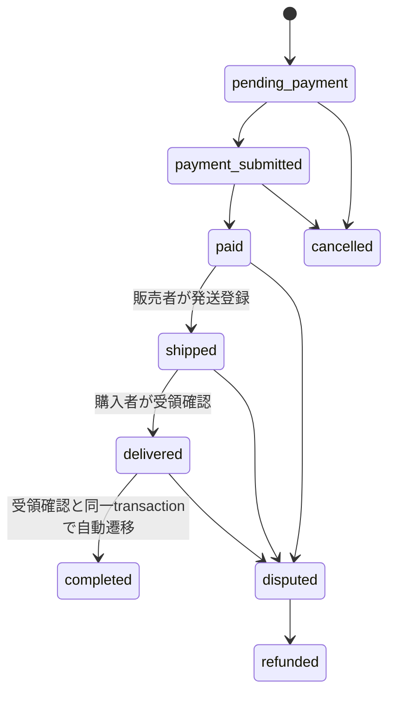
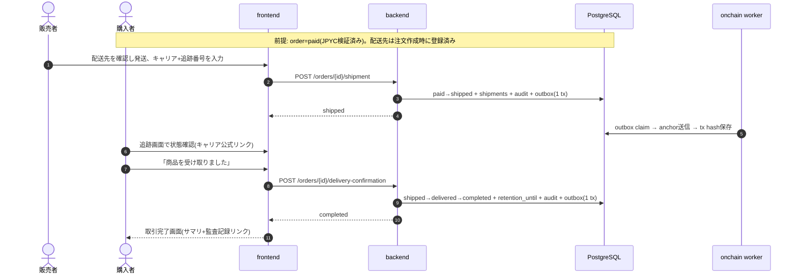

# 発送・購入完了フロー設計書

**基準日: 2026年8月20日**

本書は、支払い確定(order=paid)以降の発送・受領・取引完了までの状態機械、データモデル、API契約、配送先PIIの取扱いを定義する。[database-schema.md](./database-schema.md) §12で未決定だった「配送先PII」の設計を確定させるものであり、既存の設計原則(サーバー間通信のみを信用 / PII最小化 / フェイルセーフ / 段階的信頼)を維持する。

対象読者: backend・frontend実装者。

---

## 1. 方針

1. 配送業者APIとは連携しない。**キャリア選択+追跡番号の手入力**と状態機械で追跡性を担保し、実際の輸送状況はキャリア公式追跡ページへの外部リンクで参照する
2. 状態の真実はDBの状態機械のみ。ブラウザ申告(「発送した」「受け取った」)は当事者の操作として記録するが、**期待遷移元をWHERE句に含むUPDATEでのみ**遷移する(0件更新=409)
3. 配送先住所は**注文単位**で保存する唯一のPIIとし、参照可能者・保持期限・削除を最初から設計に含める
4. 発送・受領・完了の各イベントは`audit_events` + `onchain_outbox`へ記録する(async-onchain-write.mdの契約通り。PIIはpayloadへ含めない)

---

## 2. 状態機械(orders拡張)

migration `0004` で `orders.status` のCHECK制約へ `shipped` / `delivered` を追加する。

- `delivered → completed` は受領確認APIの同一transactionで連続適用する(MVPでは受領=完了。両状態を分けるのは、将来の申告猶予期間導入時に互換を保つため)
- `disputed`はpaid/shipped/deliveredから遷移可能(既存設計の維持)。運用は管理コンソールでの状態確認まで(本期スコープ)

## 3. データモデル(migration 0004)

### 3.1 `shipments`

| 列 | 型 | 制約・用途 |
|---|---|---|
| `id` | uuid PK | |
| `order_id` | uuid → orders | **unique**(1注文1発送。再発送は行更新+イベント記録) |
| `carrier` | varchar + CHECK | `yamato` / `sagawa` / `japan_post` / `other` |
| `carrier_name_other` | varchar NULL | `other`時のみ必須(service層で強制) |
| `tracking_number` | varchar(64) | 空文字不可。形式はキャリア差が大きいため長さ・文字種(英数ハイフン)のみ検証 |
| `shipped_at` / `delivered_at` | timestamptz | 登録・受領確認時刻 |
| `created_at` / `updated_at` | timestamptz | trigger更新 |

### 3.2 `order_shipping_addresses`(PII)

| 列 | 型 | 制約・用途 |
|---|---|---|
| `id` | uuid PK | |
| `order_id` | uuid → orders | **unique**(注文作成時に1件) |
| `recipient_name` | varchar(100) | 受取人氏名 |
| `postal_code` | varchar(8) | `NNN-NNNN`へ正規化 |
| `prefecture` / `city` / `address_line1` | varchar | 必須 |
| `address_line2` | varchar NULL | 建物名等 |
| `phone_number` | varchar(15) | 数字・ハイフンのみ |
| `retention_until` | timestamptz NULL | 取引完了時に `completed_at + 90日` を設定 |
| `created_at` | timestamptz | |

### 3.3 PII境界(database-schema.md §8への追補)

- 配送先PIIを保存するのは`order_shipping_addresses`**のみ**。orders・audit_events・ログ・オンチェーンpayload・APIレスポンス(当事者以外)へ複製しない
- 参照可能者: 注文のbuyer(自分の入力確認)、seller(発送作業のためpaid〜shipped期間の参照が業務上必要)、運営者(admin API)。それ以外は404/403
- `retention_until`超過行の削除jobは本番前の別Issueとする(列と設計だけ先に確定)。アプリ層暗号化も同Issueで判断し、MVPはCloud SQL保存時暗号化+アクセス制御で担保する
- 監査payloadへは`orderId`・状態・時刻のみ。氏名・住所・追跡番号は含めない(追跡番号は準識別子として保守的に扱う)

## 4. API契約(api-catalog.md §6.5への追補)

| Method | Path | 認可 | 用途 |
|---|---|---|---|
| `POST` | `/api/v1/orders/{orderId}/shipment` | 販売者(wallet session) | 発送登録。order `paid`→`shipped` + shipments作成。body: `{carrier, carrierNameOther?, trackingNumber}` |
| `POST` | `/api/v1/orders/{orderId}/delivery-confirmation` | 購入者(wallet session) | 受領確認。`shipped`→`delivered`→`completed`。body なし |
| `GET` | `/api/v1/orders/{orderId}` | 取引当事者/運営者 | 既存契約を拡張し、`shipment`・`shippingAddress`(参照権限がある場合のみ)・`auditAnchors`(anchor tx hash)を含める |

- 発送登録の同一transaction: `orders`遷移 + `shipments` INSERT + `audit_events`(`order.shipped`) + `onchain_outbox`
- 受領確認の同一transaction: `orders`を`shipped→delivered→completed`へ + `shipments.delivered_at` + `order_shipping_addresses.retention_until`設定 + `audit_events`(`order.completed`) + `onchain_outbox`
- 遷移競合(期待状態不一致)は`409 CONFLICT`、コード`ORDER_STATE_CONFLICT`
- エラーコード: `SHIPMENT_ALREADY_REGISTERED` / `INVALID_TRACKING_NUMBER` / `SHIPPING_ADDRESS_NOT_VISIBLE`

## 5. シーケンス

## 6. 画面との対応

[screen-design.md](./screen-design.md) §3.8(配送先入力)・§3.9(発送登録・追跡・受領確認・完了画面)を正とする。

## 7. テスト観点

- 正常系: paid→shipped→delivered→completed の一連(E2Eへ組込み)
- 不正遷移: 未払いでの発送登録、未発送での受領確認、二重発送登録 → 409
- 認可: buyerによる発送登録・sellerによる受領確認の拒否、第三者による配送先参照の拒否
- PII: audit payload・一覧APIレスポンスへ配送先が漏れないこと
- migrationテスト: 0004適用・再実行・制約(unique・CHECK)検証
