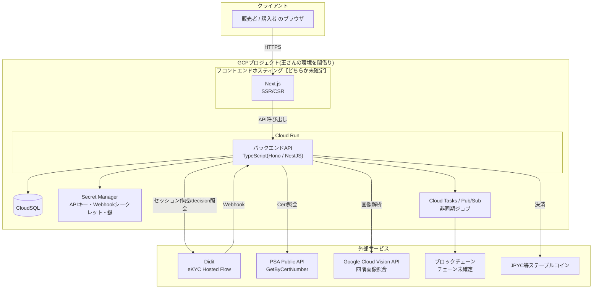
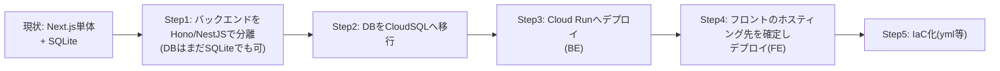
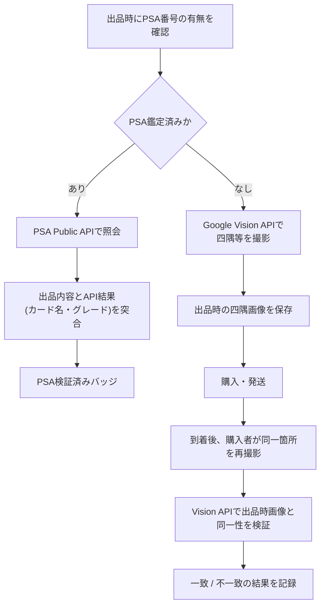
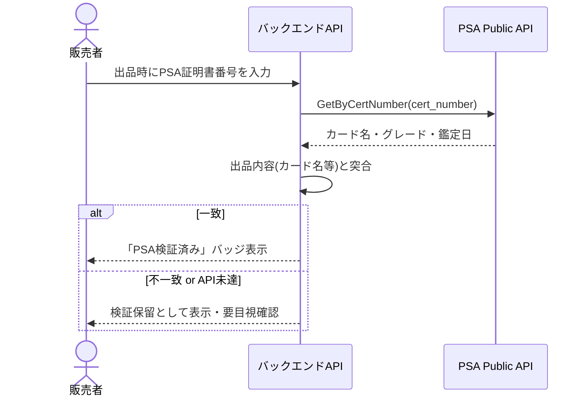
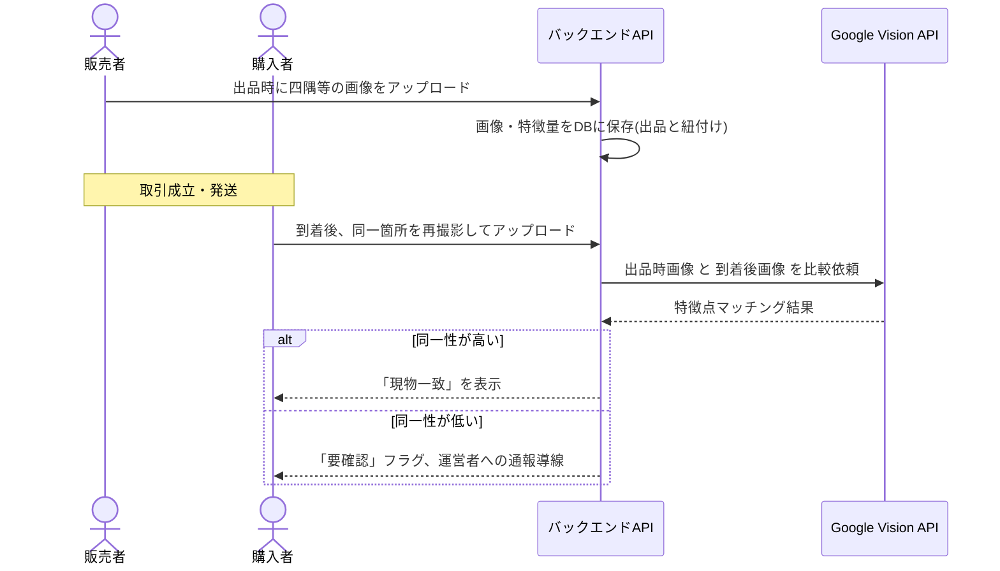
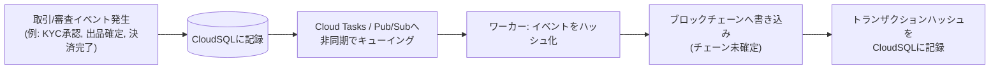

# システムアーキテクチャ設計書

**基準日: 2026年8月6日**

本書は、2026年8月6日の定例MTGでの決定事項([docs/mtg/20260806.km](../mtg/20260806.km))を起点に、[README.md](../../README.md)のeKYC設計、[docs/design/seller-onboarding-review-flow.md](./seller-onboarding-review-flow.md)の審査フロー、[docs/research/trustca-market-research.md](../research/trustca-market-research.md)の競合分析、および現行実装(`ekyc/`)を統合し、プロダクト全体の**システムアーキテクチャ**を定義する。

対象読者: インフラ構築・バックエンド実装・フロントエンド実装を担当する開発者。

---

## 0. ドキュメント間の関係

| ドキュメント | スコープ |
|---|---|
| [README.md](../../README.md) | eKYC設計そのもの(5層信頼モデル、Didit採用理由、本番移行方針) |
| [docs/design/seller-onboarding-review-flow.md](./seller-onboarding-review-flow.md) | 販売者登録〜審査の業務フロー詳細(運営者による人手審査を含む) |
| [docs/research/trustca-market-research.md](../research/trustca-market-research.md) | 競合調査・ポジショニング(事前型審査というコンセプトの根拠) |
| **本書** | 上記を実現する**システム構成・インフラ・データ基盤**。8/6 MTGでの技術選定を起点にする |

---

## 1. アーキテクチャ方針(2026-08-06 MTG決定事項)

MTGでの決定・合意事項をそのまま起点とする。「未確定」の項目は9節にまとめて再掲する。

| レイヤー | 決定内容 | 状態 |
|---|---|---|
| フロントエンド | Next.js | 確定 |
| フロントエンドのホスティング先 | Firebase **または** GCP のどちらか | **未確定**(「どっちか」) |
| バックエンド言語 | TypeScript | 確定 |
| バックエンドフレームワーク | Hono または NestJS 系統 | **未確定**(候補のみ) |
| バックエンド実行基盤 | GCP Cloud Run | 確定 |
| DB | GCP CloudSQL | 確定 |
| ローカル開発環境 | Docker Compose | 確定 |
| コーディングエージェント | Claude Code | 確定 |
| インフラ環境 | 王さんの既存GCP環境を間借りする | 確定(ただしプロジェクト分離方針は未確定) |
| IaC | 当面は手動構築、後からyml等でコード化する(順序として後回みで合意) | 確定(順序) |

現行実装(`ekyc/`)はNext.js App RouterのRoute Handlersがバックエンドを兼ね、DBはローカルファイルの`better-sqlite3`である。MTGの決定は「フロントとバックエンドを分離し、DBをマネージドのCloudSQLに寄せる」方向であるため、本書はこの**移行**を軸に構成する(4節)。

---

## 2. 全体構成図(目標アーキテクチャ)

現行の`ekyc/`はこの図の「FE」と「BE」がNext.js 1プロセスに同居し、「DB」がSQLiteファイルになっている状態に相当する。

---

## 3. 5層信頼モデルとの対応

README 1節の5層信頼モデルに、担当コンポーネントと実装状況を対応させる。

| 信頼層 | 確認内容 | 担当技術 | 実装状況 | 該当コンポーネント |
|---|---|---|---|---|
| 人物の信頼 | 本人確認書類・顔照合・ライブネス・重複人物 | eKYC(Didit) | ✅ 実装済み(`ekyc/`) | BE ⇔ Didit |
| アカウントの信頼 | 電話・メール・端末・IP | eKYC付帯機能+自社実装 | ⬜ 未着手 | BE + DB |
| 商品情報の信頼 | カード名・グレード・PSA Cert情報 | PSA Public API+OCR | ⬜ 未着手(本書5.3で設計) | BE ⇔ PSA / Vision |
| 物理商品の信頼 | 所持確認・画像の同一性 | nonce再撮影+Vision API | ⬜ 未着手(本書5.3で設計) | BE ⇔ Vision |
| 取引行動の信頼 | 価格・頻度・通報率 | 自社Risk Engine | ⬜ 未着手 | BE + DB |

MTGで合意した「ブロックチェーン活用」(改竄防止の監査証跡・JPYC決済)は、この5層モデルの**外側**に位置する横断的な機能として5.4節で扱う。特定の信頼層を代替するものではなく、既存の各層の判定結果や取引記録を「後から改竄できない形で残す」「決済手段を追加する」という位置づけである。

---

## 4. 現行PoC(`ekyc/`)と目標アーキテクチャの差分

### 4.1 差分表

| 観点 | 現行(`ekyc/`) | 目標(MTG決定) | 移行の要否 |
|---|---|---|---|
| フロント/バック分離 | Next.js App RouterのRoute Handlersが同居 | Next.js(FE)とTS API(BE, Hono/NestJS)を分離 | 要 |
| DB | `better-sqlite3`(ローカルファイル、`data/ekyc.db`) | CloudSQL(マネージド) | 要 |
| Webhook到達性 | ローカルでは届かないため`ngrok`が必要 | Cloud Runは常時公開URLを持つため`ngrok`不要 | 移行で解消 |
| ビジネスロジック | `src/lib/didit/{client,normalize,signature}.ts` | ほぼそのまま移植可能(フレームワーク非依存な純関数群) | 小 |
| 実行環境 | `next dev` / `next start` | Cloud Run(コンテナ) | 要 |
| ローカル開発 | `pnpm dev`単体 | Docker Compose(FE+BE+DB) | 要 |

### 4.2 移植しやすい理由

`ekyc/src/lib/didit/`配下(`client.ts`・`normalize.ts`・`signature.ts`)はNext.js固有のAPIに依存しない純粋なTypeScript関数として書かれている。移行時はこれらをほぼそのままバックエンドサービスへ移し、以下の2点だけを書き換えればよい。

1. `src/lib/db.ts`: `better-sqlite3`のクエリをCloudSQL用クライアント(`pg`など)に置き換える。テーブル定義(`sellers` / `seller_verifications` / `webhook_logs` / `verification_events`)はスキーマ設計の土台としてそのまま使える。
2. `src/app/api/**/route.ts`: Next.js Route HandlerのハンドラをHono/NestJSのルートハンドラに移植する。バリデーション・エラーハンドリングの構造は流用可能。

### 4.3 移行の進め方(推奨)

ハッカソンの時間制約を踏まえ、一度に全面移行せず段階的に進めることを推奨する。

---

## 5. 機能アーキテクチャ

MTGの「主な機能」を、既存実装・新規実装に分けて設計する。

### 5.1 eKYCを使った販売者登録フロー(実装済み・移行対象)

設計・実装済み。詳細はREADME 2節・3節と[seller-onboarding-review-flow.md](./seller-onboarding-review-flow.md)を参照。本書としては次の2点のみ補足する。

- **移行の影響**: Cloud Runは公開URLを持つため、Webhook検証を現行の「ローカルはポーリングのみ、Webhookは`ngrok`必須」という制約なしに、開発環境でも本番相当のWebhook経路を検証できるようになる。
- **未実装ギャップの引き継ぎ**: 運営者による`in_review`解消(人手審査画面・承認/却下API)は[seller-onboarding-review-flow.md 5節](./seller-onboarding-review-flow.md#5-運営者確認フローは必要か)で設計済みだがコード未実装。バックエンド分離後の実装対象として10節のロードマップに引き継ぐ。

### 5.2 基本的なカードの販売機能(新規)

MTGでは機能名のみの合意で詳細設計はこれから。最小構成の方向性を示す。

- データモデル(最小): `cards`(出品情報)、`orders`(取引)。`sellers`は既存の`ekyc/`スキーマを流用。
- 出品は`seller_verifications.status = approved`(=`isSellingAllowed`)の販売者のみ許可 — README 2.1原則4「eKYC合格 ≠ 無制限出品」に従い、金額上限・出品数制限は`sellers`または新設の`seller_limits`テーブルで管理する。
- 詳細な画面・API設計は本書のスコープ外とし、着手時に別途設計する。

### 5.3 カードの本物かどうかのチェック

MTGでPSAの有無で経路を分岐させる方針が合意された。

#### 5.3.1 PSAあり経路

[docs/research/trustca-market-research.md](../research/trustca-market-research.md) 2.4節記載の通り、PSA Public APIの無料枠は2026年半ばから約1コール/日に縮小される見込みであるため、**デモの安定運用には有料プランへの移行検討が必要**(9節の未決定事項に記載)。

#### 5.3.2 PSAなし経路(Vision API + nonce再撮影)

README 3節の「物理商品の信頼」層で言及されているnonce再撮影の考え方をそのまま踏襲する。

### 5.4 ブロックチェーン活用(新規・横断機能)

MTGで挙がった2つの用途を分けて設計する。両者は独立した機能であり、片方だけを先行実装することも可能。

#### 5.4.1 取引情報の非同期ブロックチェーン書き込み(改竄防止)

- 目的: 取引・審査結果などの重要イベントのハッシュをブロックチェーンに刻み、後から改竄できないことを証跡として示す。
- **同期処理には組み込まない**(README原則1「サーバー間通信のみを信用する」と同じ発想で、ブロックチェーン書き込みの遅延・失敗が主要フローをブロックしてはならない)。

#### 5.4.2 JPYC等の仮想通貨による決済

- 決済はJPYC等のステーブルコインで行う想定。
- **ウォレット管理方式が未確定**: 購入者・販売者が自己保有ウォレット(MetaMask等)を使う方式と、バックエンドが管理ウォレットを持つ方式では、鍵管理(Secret Manager/KMS利用の要否)・規制対応・実装コストが大きく異なる。9節の未決定事項として扱う。
- [trustca-market-research.md 5節](../research/trustca-market-research.md)の法務メモにある通り、エスクロー構成は資金決済法の論点があるため、実際の資金を動かす前に**法務確認が必要**。ハッカソンのスコープでは、リスクの低い5.4.1(ハッシュ書き込みによる改竄防止の証跡)を優先し、5.4.2(実決済)はストレッチゴールとして10節に位置づける。

---

## 6. ローカル開発環境(Docker Compose)

MTGでDocker Composeでのローカル開発が合意された。目標構成は以下の3コンテナを想定する(バックエンド分離後)。

| サービス | 役割 | 備考 |
|---|---|---|
| `frontend` | Next.js(`next dev`) | ポート例: 3000 |
| `backend` | Hono/NestJS API | ポート例: 8080。CloudSQLの代わりにローカルの`db`サービスに接続 |
| `db` | PostgreSQL(またはMySQL) | CloudSQLのエンジンに合わせる(未確定、9節参照) |

現行の`ekyc/`は単体で`pnpm dev`から動くため、Docker Compose化は「バックエンド分離」(4.3節 Step1)以降に着手するのが自然な順序である。

---

## 7. インフラ・デプロイ構成

- **GCPプロジェクト**: 王さんの既存GCP環境を間借りする(MTG決定)。ただし、課金・IAM権限の分離方針(専用のGCPプロジェクトを新規に切るか、既存プロジェクト内にリソースを追加するか)は未確定 — 9節参照。
- **Cloud Run**: バックエンドAPI(Hono/NestJS)をコンテナとしてデプロイ。Webhook受信(Didit等)に必要な公開URLを標準で持つ。
- **CloudSQL**: Cloud Runからは Cloud SQL Auth Proxy / Cloud SQL言語コネクタ経由で接続する。
- **Secret Manager**: `DIDIT_API_KEY`・`DIDIT_WEBHOOK_SECRET_KEY`・PSA APIキー・Google Vision認証情報・(将来)ブロックチェーンのRPCキーやウォレット鍵を保管し、ブラウザには一切渡さない(README 4.5節の方針を踏襲)。
- **IaC**: MTGの合意通り、まず手動構築(GCPコンソール/`gcloud` CLI)で動くものを作り、後からyml等(Cloud Runサービス定義yaml、Terraform等)でコード化する。ツール選定は9節の未決定事項。

---

## 8. セキュリティ・データ方針の継承

README 2.1節の設計原則は、機能が増えても崩さずに横展開する。

1. **結果の真実のソースはサーバー間通信のみ** — PSA照会結果・Vision API判定結果・ブロックチェーン書き込み結果も、ブラウザから送られた値ではなくバックエンドが直接取得・記録した値だけを信用する。
2. **PIIを自社に保存しない** — 身分証情報はDidit側に残す方針を継続。カード真贋チェックで扱う画像(四隅写真等)は取引に必要な範囲に限定し、氏名・住所等の個人情報とは扱いを分離する。
3. **未知のステータス・不確実な判定は自動承認しない** — Vision APIの同一性判定やPSA照会の失敗時は「要確認」に倒し、無条件で信頼シグナルを立てない(5.3節)。
4. **段階的な信頼付与** — eKYC合格後も条件付き出品とする原則(README 2.1原則4)を、新機能(カード販売・決済)の与信設計にも適用する。

---

## 9. 未決定事項一覧

MTGの時点で結論が出ていない項目を一覧化する。実装着手前にチームで決定する必要がある。

| # | 項目 | 選択肢 | 決定に必要な情報 |
|---|---|---|---|
| 1 | フロントエンドのホスティング先 | Firebase Hosting / GCP(Cloud Run等) | SSR要否、CDN・ドメイン管理の要件 |
| 2 | バックエンドフレームワーク | Hono / NestJS | 開発速度優先(Hono)か構造・DI優先(NestJS)か |
| 3 | CloudSQLのDBエンジン | PostgreSQL / MySQL | チーム習熟度、既存スキーマとの親和性 |
| 4 | GCPプロジェクトの分離方針 | 既存プロジェクトに相乗り / 専用プロジェクトを新規作成 | 王さんの環境の課金・IAM制約 |
| 5 | IaCツール | Terraform / Cloud Run yamlのみ / その他 | チームの習熟度、導入タイミング |
| 6 | ブロックチェーンのチェーン選定 | 未定(JPYC対応チェーンとの整合が必要) | JPYC決済(5.4.2)を実施するかどうか |
| 7 | ウォレット管理方式 | 自己管理(ユーザーウォレット) / バックエンド管理ウォレット | 5.4.2の実施要否、鍵管理・規制対応コスト |
| 8 | PSA Public APIの利用プラン | 無料枠(約1コール/日) / 有料プラン | デモでの想定利用回数 |
| 9 | 運営者による人手審査画面 | 実装する / デモ台本のみで代替 | [seller-onboarding-review-flow.md 5節](./seller-onboarding-review-flow.md#5-運営者確認フローは必要か)参照 |

---

## 10. 実装ロードマップ

README 4.2節の優先順位に、本書で新たに設計した項目(カード販売・真贋チェック・ブロックチェーン・インフラ移行)を統合する。

| 優先 | 実装内容 | 状態 |
|---:|---|---|
| 1 | 販売者登録・eKYC(Didit)・署名付きWebhook | ✅ 完了 |
| 2 | 販売者ステータス・可視化 | ✅ 完了 |
| 3 | バックエンド分離(Hono/NestJS) | ⬜ |
| 4 | CloudSQLへのDB移行 | ⬜ |
| 5 | Cloud Runへのデプロイ(BE)・ホスティング確定(FE) | ⬜ |
| 6 | 基本的なカードの出品・購入機能 | ⬜ |
| 7 | PSA Public API照会・正規化(PSAあり経路) | ⬜ |
| 8 | カード撮影・Vision API照合(PSAなし経路) | ⬜ |
| 9 | Cert番号重複検知(DBユニーク制約) | ⬜ |
| 10 | nonce付き所持確認 | ⬜ |
| 11 | ルールベースRisk Engine・運営者による人手審査画面(`in_review`解消含む) | ⬜ |
| 12 | 取引情報の非同期ブロックチェーン書き込み(改竄防止) | ⬜ |
| 13 | JPYC決済連携(法務確認後・ストレッチ) | ⬜ |
| 14 | Docker Composeによるローカル開発環境整備 | ⬜ |
| 15 | IaC化(yml等) | ⬜ |

---

## 11. まとめ

2026-08-06 MTGでの決定は、現行の「Next.js単体+SQLite」PoCを、**フロントエンド/バックエンド分離・CloudSQL・Cloud Run**という構成へ発展させる方向性を示した。既存の`ekyc/`実装(特に`src/lib/didit/`配下)はフレームワーク非依存な設計になっているため移植コストは小さく、DB層とルーティング層の付け替えが移行の中心作業になる。

MTGで新たに合意された「カードの真贋チェック(PSA/Vision APIの二経路)」「ブロックチェーン活用(改竄防止の証跡・JPYC決済)」は、README既出の5層信頼モデルを土台にしつつ、後者は横断的な新機能として設計した。ただし後者は法務・鍵管理面でリスクが大きいため、ハッカソンではまず改竄防止の証跡書き込みに絞り、実決済はストレッチゴールとすることを推奨する。

9節の未決定事項(特にフレームワーク・DBエンジン・GCPプロジェクト構成)は、実装着手前にチームで確定させる必要がある。
