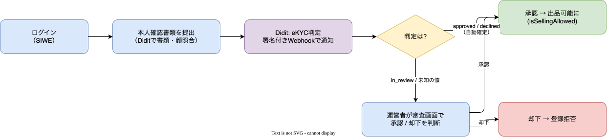
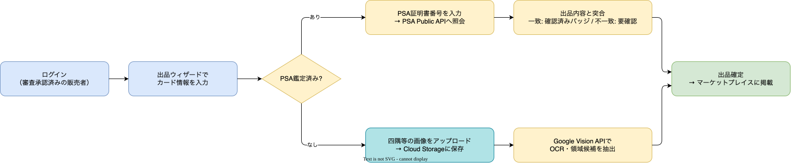
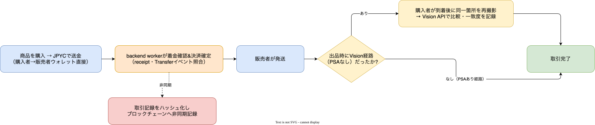
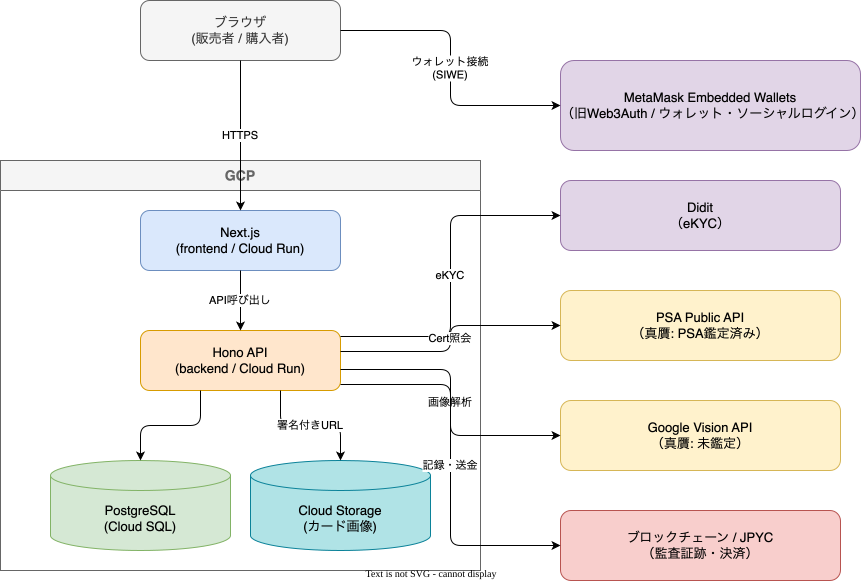

<!-- _paginate: false -->

# Trustca
### 高額トレーディングカードのためのC2Cマーケットプレイス

出品前の審査で、はじめから信頼できる取引を

 

2026/8/30

---

## もくじ

1. メンバー紹介
2. 背景
3. 課題
4. 目的
5. 機能（スコープ）
6. ユースケース別フロー
7. システム構成
8. デモ
9. 残課題
10. 所感

---

## メンバー紹介
- WHXisWH
- Yasunari Iguchi

<!--
発表者が直接紹介する前提の簡易スライドです。
役割分担など、実際の内容に置き換えてください。
-->

---

## 背景

- ポケモンカード市場が急拡大
  - ノスタルジア需要 × 収集ブーム × グレーディングによる「状態の資産化」
- 高額化にともない、偽造品・リプレイカが急増
- 高額カードは「疑ってかかる」のが買い手の前提に
- 真贋の担保が、マーケットプレイスの中心的な競争軸になっている

---

## 課題

C2Cの高額トレカ売買が抱える3つの信頼問題

- 偽物の出品
- 状態の虚偽表示
- 盗品・不正アカウント

既存サービス（magi / スニーカーダンク / メルカリ あんしん鑑定）は、
いずれも**実績を積んでから**信頼を認める「事後型」

- 悪質な出品者の参入自体は防げない
- 実績のない優良な新規の売り手が、信頼を示す手段を持てない

---

## 目的

**既存サービスは実績を待つ。Trustcaは入口で審査する。**

- eKYCによる本人確認を起点に、出品前の入口で審査する
- 実績がなくても、初めての売り手が信頼を示せる仕組みをつくる
- 「1回の審査通過」に無制限の信頼を与えず、段階的に信頼を積み上げる

---

## 機能（スコープ）

1. eKYCによる販売者登録・審査（Didit）
2. カードの出品・購入
3. カードの真贋チェック
   - PSA鑑定済み → PSA Public APIで照会
   - 未鑑定 → 撮影 + 到着後の再撮影で比較
4. ブロックチェーンでの改竄防止 & JPYC決済（コア機能の外側にある追加機能）

---

## 販売者登録フロー

- Diditの判定が明確なら自動確定、あいまいなら運営者が確認する

---

## 出品フロー

- PSA鑑定済みか否かで真贋チェックの経路が分かれる

---

## 購入フロー

- 決済確定とブロックチェーン記録は非同期（記録の遅延・失敗が取引をブロックしない）
- 到着後の再撮影比較は、出品時にPSA番号がない場合のみ発生する

---

## システム構成

<!--
- ローカル開発は Docker Compose で frontend / backend / DB を一括起動
- 業務ロジックはすべて backend に集約（frontend は画面描画のみ）
-->

---

## デモ

実際の画面で、先ほどの3つのフローを操作して見せる

1. 販売者登録（eKYC）
2. 出品（PSA照会 / カード画像アップロード）
3. 購入（JPYC決済）

<!-- 各ステップの画面を切り替えながらデモ -->

---

## 残課題

- 運営者による審査は承認/却下の二択のみ
  → 差戻し等を含む正式な審査キューは未実装
- 到着後の再撮影による比較フロー（UI・業務フロー）が未実装
- 価格・頻度・通報率に基づくRisk Engineが未着手
- PSA Public APIの利用上限を未確認（契約条件の確認待ち）
- ブロックチェーン・JPYC決済は本番chain未deploy、法務確認前
- インフラの一部が未決定（ホスティング先、GCPプロジェクト構成 等）

---

## 所感

<!--
チームとして学んだこと・苦労した点・今後に活かしたいことなどを記入してください
-->

- （記入）
- （記入）
- （記入）

---

<!-- _paginate: false -->

# ご清聴ありがとうございました
