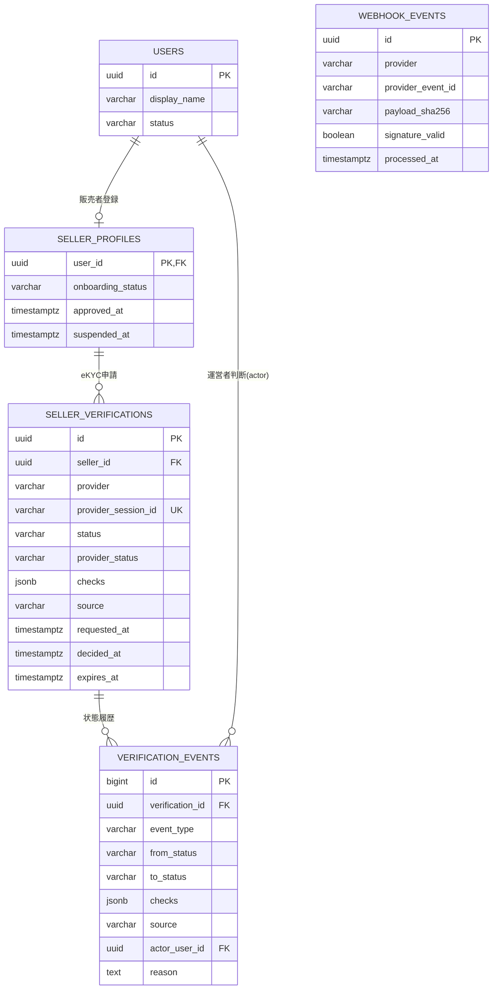

# Data Model: 販売者登録フロー実装

既存の`backend/src/db/migrations/0001_initial_schema.sql`のテーブルをそのまま使う(新規migrationなし)。以下は本機能が読み書きする範囲の抜粋。

## Entity関係



`webhook_events`は`seller_verifications`への外部キーを持たない独立台帳(未知session・署名不正の受信も監査対象として記録するため)。

## State model

`seller_verifications.status`(database-schema.md §5.1、ekyc-design.md §2.3を継承):

```text
not_started -> in_progress -> approved
                       \-> declined
                       \-> in_review -> approved  (運営者判断 / source=operator)
                       \             \-> declined (運営者判断 / source=operator)
                       \-> abandoned
not_started -> expired
```

未知の外部ステータスは`mapDiditStatus`が`in_review`へフェイルセーフする(`poc/ekyc/src/lib/didit/normalize.ts`を移植)。`in_review -> approved/declined`の遷移は`source='operator'`の場合のみ許可し、既に`approved`/`declined`で確定した行への上書きはWHERE句で拒否する(下記)。

`seller_profiles.onboarding_status`は`seller_verifications.status`と独立した値であり、本機能では`seller_verifications`が`approved`になったタイミングで`seller_profiles.onboarding_status`も`approved`へ同期する(database-schema.md §4.1の役割分離を踏襲。`seller_limits`による段階的制限の運用自体は対象外)。

## Transaction境界

database-schema.md §6.2「eKYC状態更新」を踏襲する。

| 操作 | 境界 |
|---|---|
| 販売者登録 | `users` insert + `seller_profiles` insert(`onboarding_status='pending_kyc'`)を同一transactionでcommit |
| KYCセッション作成 | Diditへの`POST /v3/session/`呼び出し(DB transaction外)→成功後に`seller_verifications` insert(`status='not_started'`, `source='created'`)+ `verification_events`(`event_type='session_created'`)を同一transactionでcommit |
| Webhook適用 | `webhook_events`重複排除insert(一意制約)→署名有効なら`seller_verifications`を期待する現在status付きUPDATE + `verification_events`(`event_type='status_changed'`または`'checks_updated'`)+ 承認確定時のみ`seller_profiles.onboarding_status`更新、を同一transactionでcommit |
| ポーリング適用 | Webhookと同じ更新ロジックを`source='poll'`で実行(Didit decision APIへの呼び出しはDB transaction外) |
| 運営者決定の適用 | 期待する現在statusが`'in_review'`であることをWHERE句に含めてUPDATE(0件なら409相当)。`verification_events`(`event_type='operator_decision'`, `actor_user_id`, `reason`)追加 + 承認時は`seller_profiles.onboarding_status`更新、を同一transactionでcommit |

外部API呼び出し(Didit)はいずれもDB transactionの外側で先に完了させ、transaction内では検証済み結果の反映だけを行う(database-schema.md §6.1と同じ方針)。

## Repository関数(api-catalog.md §7を踏襲)

- `sellerRepository`: `createSeller(displayName)`, `getSellerById(sellerId)`, `getPublicSellerById(sellerId)`
- `verificationRepository`: `createSession({sellerId, providerSessionId})`, `getActiveForSeller(sellerId)`, `getBySessionId(providerSessionId)`, `applyProviderDecision({sessionId, status, checks, source})`, `recordOperatorDecision({sessionId, decision, reason, actorUserId})`, `listInReview()`, `recordWebhookEvent({...})`
