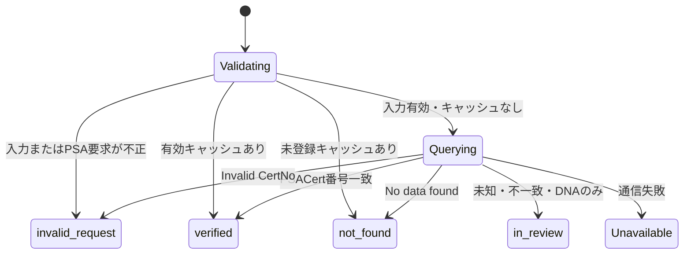

# データモデル: PSA証明書照会MVP

## PsaVerification

| Field | Type | Rule |
|---|---|---|
| `certNumber` | string | 要求した1〜32桁の数字 |
| `status` | enum | `verified` / `not_found` / `invalid_request` / `in_review` |
| `checkedAt` | ISO 8601 string | PSAまたはキャッシュ元の確認時刻 |
| `expiresAt` | ISO 8601 string | キャッシュ有効期限 |
| `source` | literal | `psa` |
| `cacheHit` | boolean | 現在のレスポンスがキャッシュ由来か |
| `card` | PsaCard? | `verified`時だけ付与 |
| `reasonCode` | enum? | 未登録、不正、番号不一致、カード情報なし |

## PsaCard

PSAの`PublicPSACert`から、Trustcaの出品照合に必要なフィールドだけを取り込む。

| Field | Type |
|---|---|
| `certNumber` | string |
| `year`, `brand`, `category` | string or null |
| `cardNumber`, `subject`, `variety` | string or null |
| `gradeDescription`, `cardGrade` | string or null |
| `totalPopulation`, `populationHigher` | integer or null |

## State Transition

`Unavailable`は業務結果として保存せずHTTP 503に変換する。
