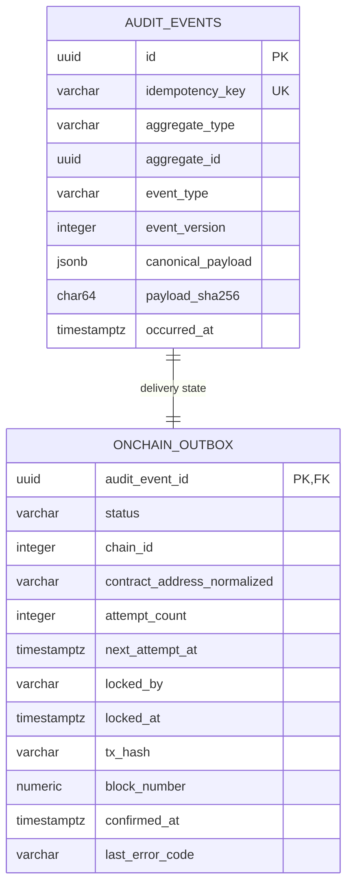

# Data Model: 取引情報の非同期オンチェーン記録

## Entity関係



## State model

```text
pending -> processing -> confirmed
                   \-> retry -> processing
                   \-> submitted -> processing (receipt再確認)
                   \-> dead
```

## Transaction境界

| 操作 | 境界 |
|---|---|
| event登録 | `audit_events` + `onchain_outbox`を同一transactionでcommit |
| worker claim | 候補lock + `processing`更新を1 statementでcommit |
| RPC送信 | DB transaction外 |
| tx hash保存 | `processing`かつ`locked_by`一致を条件に更新 |
| receipt確定 | status、tx hash、block、confirmed時刻を1 updateで保存 |

## Contract storage

| Key | Value |
|---|---|
| `keccak256(UTF8(audit_event_id))` | `bytes32(payload_sha256)` |

`occurredAt`はeventへemitする。canonical payload自体はcontract storageにもevent logにも書かない。
