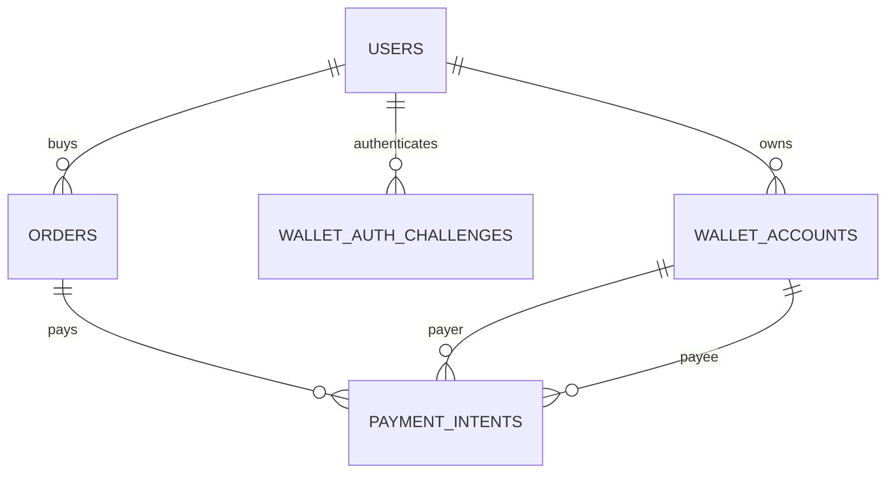

# Data Model: JPYC決済MVP

## 1. 関係

## 2. `wallet_auth_challenges`

- nonce本文を保存せず`nonce_sha256`を保存する。
- chain + address単位のrate limitとaccount作成のadvisory lockに利用する。
- `used_at`と`expires_at`でreplayを拒否する。

## 3. `payment_intents`

| 区分 | 列 |
|---|---|
| 業務参照 | `order_id` |
| 支払snapshot | payer/payee wallet ID、chain、token、from、to、amount、decimals |
| 状態 | status、expires/submitted/confirmed時刻 |
| chain根拠 | tx hash、block number |
| worker | attempt、next verification、lock、last error |

open intentはorderごとに1件、tx hashはchainごとに1件に制約する。confirmedにはtx hash、confirmed時刻、block numberを必須とする。

## 4. Atomic update

receipt確認後、次の3更新を同じtransactionで行う。

1. `payment_intents.submitted → confirmed`
2. `orders.payment_submitted → paid`
3. `listings.reserved → sold`

いずれかの期待statusが違えば全体をrollbackし、部分的な支払確定を残さない。
