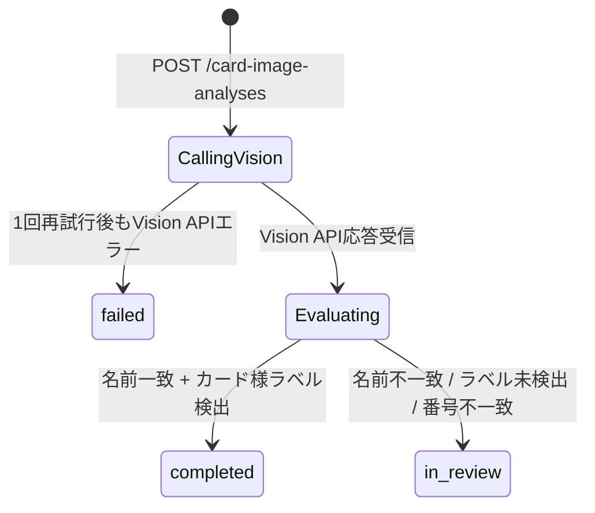

# データモデル: Vision APIによるカード画像コンテンツチェックMVP

新規migrationは追加しない。`backend/src/db/migrations/0001_initial_schema.sql`の既存テーブルをそのまま利用する(research.md §1)。本書は本機能が使うカラムと、新しく定義するアプリケーション層の型を記す。

## 既存テーブル(参照のみ・スキーマ変更なし)

### `cards`(抜粋)

| Column | 本機能での用途 |
|---|---|
| `id` | 画像・解析の紐付け先 |
| `current_owner_id` | 出品時アップロードの権限チェック(アップロード者がこの値と一致するか) |
| `name` / `series` / `card_number` | OCR結果との突合対象(「申告内容」) |
| `status` | 本機能からは更新しない(将来、解析結果を`in_review`遷移のトリガにするかは別タスク) |

### `card_images`(抜粋)

| Column | 本機能での用途 |
|---|---|
| `id` | `CardImage.imageId` |
| `card_id` | 対象カードへの参照 |
| `uploaded_by_user_id` | アップロード者(出品者/購入者)の`WalletSession.userId` |
| `image_kind` | `front`/`back`/`label`/`corner_top_left`等。出品時・到着後のどちらでも同じ値域を使い、`uploaded_by_user_id`と`cards.current_owner_id`の関係(出品時点の所有者か否か)で出品時/到着後を区別する |
| `storage_bucket` / `storage_object` | 非公開GCSバケットのobject key |
| `content_type` / `byte_size` / `sha256` | アップロード完了確認時にbackendが検証する値 |
| `capture_nonce` | 本MVPでは未使用(NULL)。所持確認(roadmap優先10)で使う想定の列 |
| `retention_until` | 本MVPでは未設定(NULL)。保持期間ポリシーは未決定(spec.md Assumptions) |

### `card_image_analyses`(抜粋)

| Column | 本機能での用途 |
|---|---|
| `id` | `CardImageAnalysis.analysisId` |
| `card_id` / `source_image_id` | 解析対象画像(到着後画像) |
| `comparison_image_id` | 本MVPでは常にNULL(自社比較ロジック=`image_comparison`は対象外。research.md §2) |
| `analysis_kind` | 本MVPでは`'ocr'`固定。1回のVision API呼び出しでOCR・ラベル・領域を同時取得し、主目的であるOCR突合を代表させる |
| `provider` | `'google_vision'` |
| `model` | 未使用(NULL) — Vision APIはモデル選択不要 |
| `status` | `pending`は不使用。`completed`(内容整合) / `in_review`(要確認) / `failed`(Vision API呼び出し失敗)のいずれかを同期的に確定させて書き込む |
| `score` | 0〜1。§「判定ロジック」参照 |
| `normalized_result` | 下記`AnalysisResult`型をJSONBとして保存 |

## アプリケーション層の型(新規)

### `AnalysisResult`(`card_image_analyses.normalized_result`の形)

| Field | Type | 説明 |
|---|---|---|
| `ocrText` | string | Vision APIの`fullTextAnnotation.text`(正規化前の生テキスト) |
| `matchedName` | boolean | 正規化後の`cards.name`がOCRテキストに含まれるか |
| `matchedCardNumber` | boolean \| null | `cards.card_number`がNULLでなければ判定、NULLなら未評価(null) |
| `cardLikeLabelDetected` | boolean | `LABEL_DETECTION`がカード関連ラベルを閾値以上で検出したか |
| `labels` | `{ description: string; score: number }[]` | 上位ラベル(監査・運営者確認用) |
| `objectBoundingBoxes` | `{ name: string; score: number }[]` | `OBJECT_LOCALIZATION`の検出結果要約 |
| `failureReason` | string \| null | `status = 'failed'`時のVision APIエラー概要(スタックトレースやraw responseは含めない。database-schema.md §8.2のJSONB allowlistに従う) |

JSONB allowlistの遵守: OCRテキストや検出ラベルは許可対象(database-schema.md §8.2 `card_image_analyses.normalized_result`行)。画像base64・Vision APIの生JSON全体・認証情報は保存しない。

### 判定ロジックとstatusの対応

| 条件 | `status` | `score` |
|---|---|---|
| Vision API呼び出しが(1回再試行後も)失敗 | `failed` | `null` |
| `matchedName = false`、または`cardLikeLabelDetected = false` | `in_review` | `0.0`(名前不一致)または`0.5`(名前一致・番号不一致) |
| `matchedName = true` かつ (`matchedCardNumber`が`true`または`null`) かつ `cardLikeLabelDetected = true` | `completed` | `1.0` |

API/UIが表示する`内容整合`/`要確認`は、`status === 'completed'` → `内容整合`、それ以外(`in_review`/`failed`) → `要確認`とマッピングする(spec.md FR-005/FR-006)。

## State Transition

`pending`/`processing`はDB制約上は許容されるが、本MVPの同期実装では使用しない(research.md §5)。
